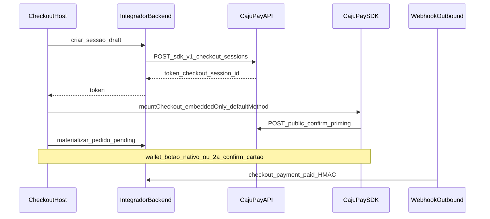
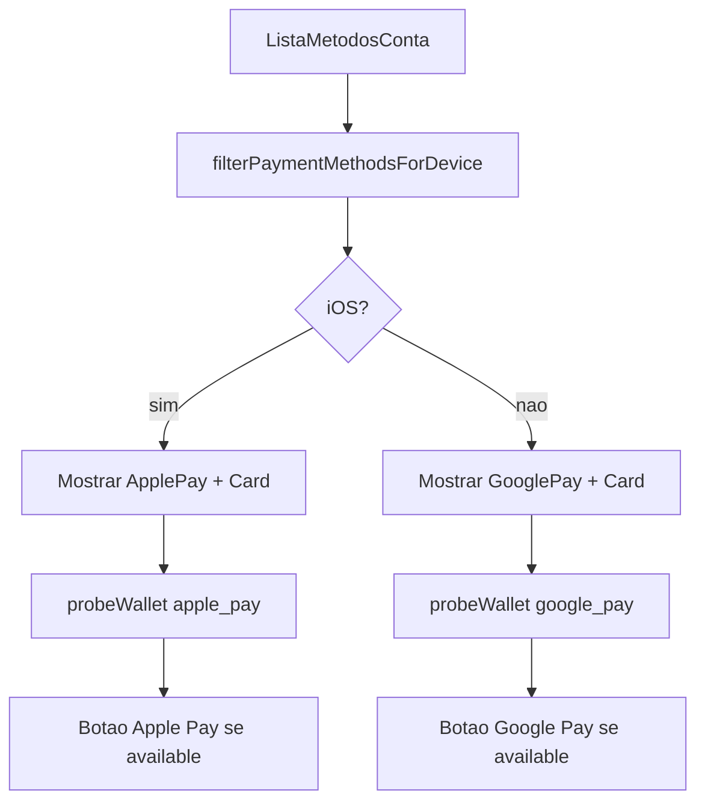
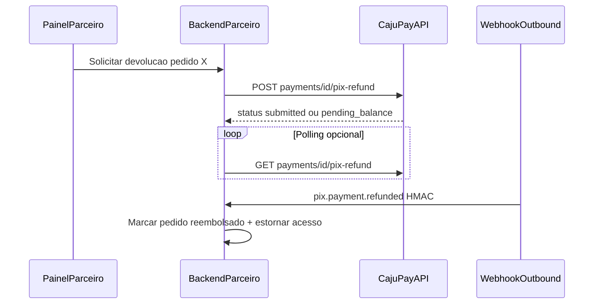
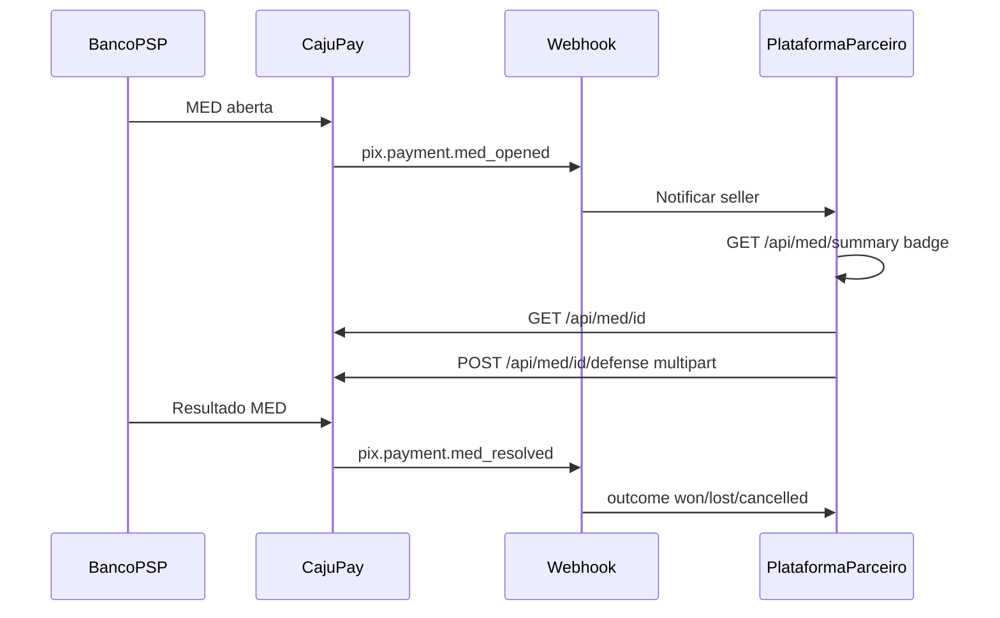
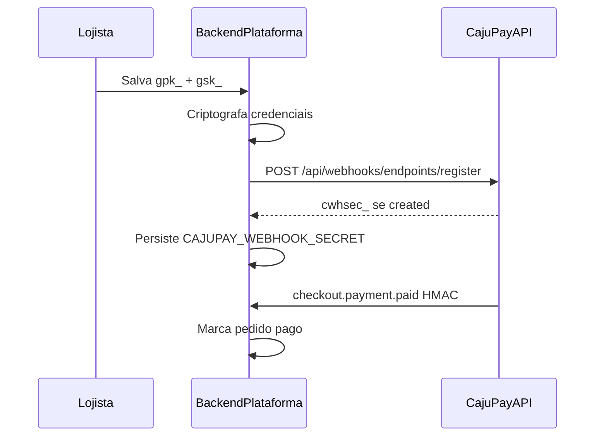
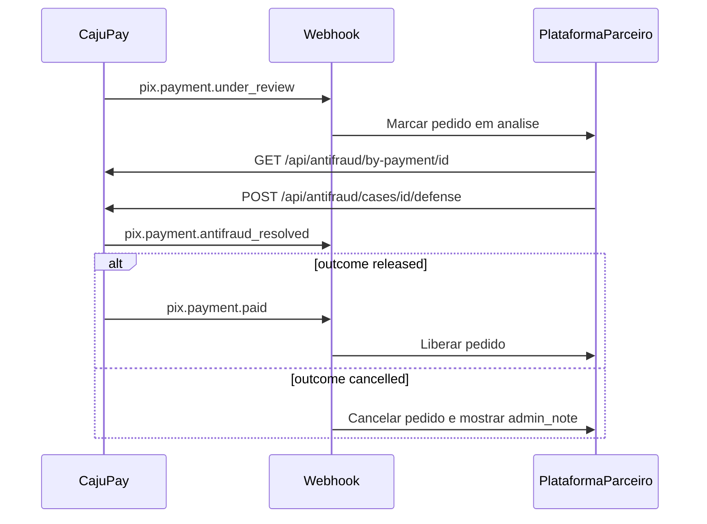

# CajuPay — Documentação completa para LLMs
> Gerado em 2026-08-02T14:14:01.243Z. Não edite à mão — rode `npm run build:llm-docs` no frontend.
> Pacote modular: https://cajupay.com.br/docs/llm/
---

---

<!-- module: 00-instructions-for-llm -->


# Instruções para o modelo de IA

## INSTRUÇÕES PARA O MODELO (obrigatório)

1. **Não invente rotas.** Use apenas endpoints documentados em `https://api.cajupay.com.br` (base deste pacote).
2. **Segredos só no servidor.** `X-API-Secret` nunca vai para o browser, bundle frontend ou repositório público.
3. **Valores em centavos.** `amount_cents: 2590` = R$ 25,90. Moeda padrão: `BRL`. **Mínimo de cobrança via API:** `amount_cents` ≥ **200** (R$ 2,00 em BRL; em outras moedas, 200 unidades menores da moeda de vitrine).
4. **Cartão e wallets exigem HTTPS** na página do checkout em produção; HTTP local costuma falhar (PSP / formulário embed).
5. **PCI:** PAN/CVV não passam pelo backend do integrador — use o SDK CajuPay (`embeddedOnly`) ou API server-side PIX.
6. **Rotas tipo `/checkout/cajupay/*` não existem na CajuPay** — o integrador implementa wrappers no próprio backend; a API nativa é `/api/sdk/v1/...` e `/api/payments/pix`.
7. **Wallets:** filtrar Apple Pay (iOS) vs Google Pay (Android/desktop); passar `defaultMethod` igual ao botão clicado; ocultar botão "Pagar" do host quando wallet estiver selecionada.
8. Ao gerar código, inclua tratamento de `methods_available`, webhooks HMAC e materialização de pedido **antes** do webhook de pagamento aprovado.
9. **PIX:** webhook outbound + job de reconciliação em background (`GET /api/payments` no servidor, ~1–2 min) — módulo **21**.
10. **Telefone em PIX:** inclua `consumer.phone` (E.164) por padrão em `POST /api/payments/pix` — necessário para SMS de Recovery/Acesso; alias `payer_phone` na raiz.

## URLs oficiais

| Recurso | URL |
|---------|-----|
| API (produção) | `https://api.cajupay.com.br` |
| Site / docs humanas | `https://cajupay.com.br/docs` |
| SDK (CDN) | `https://cdn.cajupay.com.br/sdk/v1/cajupay-sdk.min.js` |
| Logo CajuPay | `https://storage.cajupay.com.br/icone-cajupay.png` |
| Pacote LLM integração (este) | `https://cajupay.com.br/docs/llm/` |
| Bundle completo | `https://cajupay.com.br/docs/llm/bundle/full.md` |
| `llms.txt` (só perfil da empresa, não integração) | `https://cajupay.com.br/llms.txt` |

## Quando usar este módulo

Sempre. Cole no início do contexto da IA junto com os módulos específicos do cenário.

## Matriz: quais módulos incluir

| Objetivo do parceiro | Módulos além deste (00) |
|----------------------|-------------------------|
| **Só receber PIX** | 02, 03, 10, 12, **21**, 16 |
| **Checkout embed cartão** | 01, 02, 03, 04, 05, 06, 11, 15, 16 |
| **Plataforma ERP/SaaS (auto webhook)** | 02, 11, **22**, 16 |
| **+ Apple Pay + Google Pay** | Acima + 07, 08, 09, 17 |
| **Split de comissão** | 13 |
| **Saques / carteira** | 14 (+ **23** para webhook outbound de saque) |
| **Reembolso PIX (API)** | 18 (+ 12 webhook) |
| **MED PIX (consulta + defesa)** | 19 (+ 12 webhook) |
| **Antifraude PIX (consulta + provas)** | 25 (+ 12 webhook) |
| **Assinaturas PIX Automático / boleto** | **26**, **27** |
| **PIX completo (cobrança + pós-venda)** | 10, 12, **21**, 18, 19, 25, 16 |
| **Tudo** | `bundle/full.md` ou todos os `*.md` |

## Duas trilhas de pagamento (não misturar)

| Trilha | Métodos | Como integrar |
|--------|---------|---------------|
| **SDK `embeddedOnly`** | Cartão, Apple Pay, Google Pay | Sessão SDK + CDN + `mountCheckout` |
| **API REST** | PIX à vista, assinaturas, boleto | `POST /api/payments/pix`, `/api/subscriptions`, `/api/payments/boleto` |

## Prompt sugerido para o parceiro

```text
Você vai integrar o gateway CajuPay. Siga EXATAMENTE a documentação anexada (módulos markdown).
Requisitos do meu projeto:
- Stack: [ex.: Node + React / PHP Laravel / etc.]
- Métodos: [PIX / cartão / Apple Pay / Google Pay]
- Checkout: [embed no meu site / só backend]
Implemente: criação de sessão no servidor, SDK embeddedOnly se cartão/wallet, webhooks HMAC,
filtro de wallet por dispositivo, e pedido interno antes do webhook paid.
Não use rotas fictícias; mapeie session-first no meu backend.
```

## Checklist rápido antes de entregar código

- [ ] API Keys no servidor apenas
- [ ] `Idempotency-Key` em POST críticos
- [ ] HTTPS no checkout se cartão/wallet
- [ ] Webhook outbound cadastrado + validação HMAC (cartão)
- [ ] `checkout_session_id` salvo no pedido antes do pagamento

---

<!-- module: 01-overview-architecture -->


# Visão geral e arquitetura (session-first)

## INSTRUÇÕES PARA O MODELO

1. Adote **session-first**: criar sessão CajuPay antes de persistir pedido no DB do integrador.
2. O integrador implementa **draft + confirm-order** no próprio backend — não são rotas da CajuPay.
3. Guarde `checkout_session_id` como `gateway_id` do pedido **antes** do pagamento concluir.
4. Separe trilha PIX (API) de trilha SDK (cartão/wallets).

## Quando usar este módulo

Checkout embutido com cartão ou wallets; qualquer integração que precise reconciliar webhook com pedido interno.

## Arquitetura session-first (recomendada)

Fluxo validado em produção (checkout embutido adaptado à API CajuPay):

1. Pagador escolhe método (cartão / Apple Pay / Google Pay).
2. **Backend do integrador** chama `POST /api/sdk/v1/checkout/sessions` e guarda **draft** (valor, cupom, método) — **sem** pedido no DB ainda.
3. Frontend recebe `token` público + `checkout_session_id`.
4. SDK `mountCheckout` com `embeddedOnly: true` e `defaultMethod` correto.
5. **1ª `confirm()`** (priming): renderiza cartão ou botão nativo da wallet.
6. No momento certo, backend **materializa pedido** `pending` com `gateway_id = checkout_session_id`.
7. Pagador conclui (2ª `confirm()` no cartão, ou botão nativo na wallet).
8. **Webhook outbound** `checkout.payment.paid` (HMAC) marca pedido pago; polling é fallback.



### Por que session-first

- Widget aparece ao selecionar método, sem exigir e-mail antes.
- Pedidos abandonados não poluem o banco (draft com TTL ~30 min no host).
- Webhook encontra o pedido se `gateway_id` já for `checkout_session_id`.

## Mapeamento: padrão do host vs API CajuPay

| Padrão no backend do integrador | Quem implementa | API / ação CajuPay |
|--------------------------------------------|-----------------|---------------------|
| `POST /checkout/cajupay/session` | Backend do parceiro | `POST /api/sdk/v1/checkout/sessions` |
| Draft em cache + `polling_token` | Backend do parceiro | **Não existe** na CajuPay |
| `POST /checkout/cajupay/confirm-order` | Backend do parceiro | Pedido interno `pending` + `gateway_id` |
| `GET /checkout/order-status` | Backend do parceiro | Opcional: `GET /api/sdk/v1/checkout/sessions/{id}` |
| `POST /webhooks/gateways/cajupay` | Backend do parceiro | Cadastro: `POST /api/webhooks/endpoints` ou idempotente `POST /api/webhooks/endpoints/register` (plataformas) |
| PIX no checkout | Backend do parceiro | `POST /api/payments/pix` |

**Nunca** documente `/checkout/cajupay/*` como endpoints da CajuPay — são convenções do sistema do parceiro.

## Princípio PCI

- Dados de cartão **não** trafegam pelo servidor do integrador.
- O backend do parceiro só: cria sessão, persiste pedido, valida webhooks.
- **Plataformas (ERP/SaaS):** ao salvar credenciais do lojista, chamar `POST /api/webhooks/endpoints/register` — módulo **22**.
- Coleta de cartão: iframe do SDK (formulário embed) → `POST /api/sdk/public/.../confirm`.

## Multi-moeda (Caju Global)

Cartão, boleto e wallets aceitam `currency` ISO 4217 (ex. `USD`, `EUR`). PIX permanece **BRL**. Detalhes: módulo `20-multi-currency`.

## Contrato CajuPay — criar sessão (servidor)

```http
POST https://api.cajupay.com.br/api/sdk/v1/checkout/sessions
Content-Type: application/json
X-API-Key: <public_key>
X-API-Secret: <secret_key>
Idempotency-Key: <uuid-opcional-recomendado>

{
  "amount_cents": 9900,
  "currency": "BRL",
  "description": "Produto X",
  "allow_card": true,
  "allow_apple_pay": true,
  "allow_google_pay": true,
  "allow_pix": false,
  "split_id": "550e8400-e29b-41d4-a716-446655440000"
}
```

Resposta (201):

```json
{
  "checkout_session_id": "uuid-da-sessao",
  "token": "tok_publico_para_o_browser",
  "status": "active",
  "payment_status": "pending",
  "amount_cents": 9900,
  "currency": "BRL",
  "hosted_checkout_url": "https://..."
}
```

## Padrão recomendado — endpoints no host (exemplo)

```javascript
// POST /api/meu-checkout/cajupay/session  (seu backend)
// → chama CajuPay POST /api/sdk/v1/checkout/sessions
// → salva draft em Redis: { token, checkout_session_id, amount, method, ... }

// POST /api/meu-checkout/cajupay/confirm-order  (seu backend)
// → lê draft, cria Order status=pending, gateway_id=checkout_session_id
// → metadata: { cajupay_session_token, cajupay_checkout_session_id, checkout_payment_method }
```

## Erros comuns

| Erro | Causa | Correção |
|------|-------|----------|
| Webhook não acha pedido | Pedido criado só após `paid` | Materializar pedido antes do pagamento |
| SDK mostra cartão em vez de wallet | `defaultMethod` omitido | Passar `apple_pay` ou `google_pay` no mount |
| Sessão só PIX quando queria cartão | `allow_card` omitido false | Enviar `allow_card: true` (default na API) |

## Checklist

- [ ] Wrapper de sessão no servidor com API Keys
- [ ] Draft + materialização de pedido documentados no host
- [ ] `gateway_id = checkout_session_id` desde o pedido `pending`
- [ ] Webhook outbound configurado (módulo 11)

---

<!-- module: 02-authentication -->


# Autenticação e API Keys

## INSTRUÇÕES PARA O MODELO

1. Integrações servidoras usam **`X-API-Key` + `X-API-Secret`** — não OAuth para novos projetos.
2. Gere chaves no painel CajuPay (API → Chaves) ou via API de sessão (Bearer) para automação interna.
3. Solicite apenas os **escopos** necessários.

## Quando usar este módulo

Qualquer chamada à API de negócio (`/api/payments`, `/api/sdk`, `/api/webhooks`, etc.).

## Autenticação padrão (integradores)

```http
X-API-Key: gpk_xxxxxxxx
X-API-Secret: gsk_xxxxxxxx
```

Alternativa (painel / legado): `Authorization: Bearer <session_token>`.

## Escopos comuns

| Escopo | Uso |
|--------|-----|
| `payments.write` | PIX, sessões SDK, reembolso PIX, boleto avulso |
| `subscriptions.read` | Listar/consultar assinaturas e parcelas |
| `subscriptions.write` | Criar/cancelar assinaturas, retry/refund de parcelas |
| `wallet.read` | Saldo e extrato |
| `payouts.write` | Saques e chaves PIX |
| `webhooks.read` | Listar endpoints |
| `webhooks.write` | Criar/rotacionar webhooks |
| `splits.read` / `splits.write` | Split de comissão |

## Gerenciar chaves (painel / Bearer)

| Método | Rota | Notas |
|--------|------|-------|
| GET | `/api/api-keys` | Lista metadados; cria chave principal na 1ª listagem se vazio |
| POST | `/api/api-keys` | Body: `{ "name": "ERP", "scopes": ["payments.write", ...] }` — retorna `secret_key` **uma vez** |
| PATCH | `/api/api-keys?id=<uuid>` | Rotaciona secret (mesma `public_key`) |
| DELETE | `/api/api-keys?id=<uuid>` | Revoga |

Com 2FA ativo: `totp_code` obrigatório em criar/reveal/rotacionar.

## Exemplo servidor (Node)

```javascript
const CAJUPAY_API = "https://api.cajupay.com.br";

async function cajupayFetch(path, { method = "GET", body, idempotencyKey } = {}) {
  const headers = {
    "Content-Type": "application/json",
    "X-API-Key": process.env.CAJUPAY_API_KEY,
    "X-API-Secret": process.env.CAJUPAY_API_SECRET,
  };
  if (idempotencyKey) headers["Idempotency-Key"] = idempotencyKey;
  const res = await fetch(`${CAJUPAY_API}${path}`, {
    method,
    headers,
    body: body ? JSON.stringify(body) : undefined,
  });
  if (!res.ok) throw new Error(await res.text());
  return res.json();
}
```

## DO / DON'T

| DO | DON'T |
|----|-------|
| Guardar secret em env / vault | Commitar `gsk_` no git |
| Usar HTTPS para todas as chamadas | Expor secret no frontend |
| Rotacionar secret se vazou | Reutilizar `Idempotency-Key` com body diferente |

## Erros comuns

- `401 unauthorized` — par inválido ou chave revogada.
- `403 forbidden` — escopo insuficiente (ex.: criar PIX sem `payments.write`).

## Checklist

- [ ] Par public/secret em variáveis de ambiente
- [ ] Escopos mínimos necessários
- [ ] Secret nunca no bundle do browser
- [ ] **Plataformas:** também `CAJUPAY_WEBHOOK_SECRET` (`cwhsec_`) — ver módulo **22**
- [ ] Três env vars se integração completa: `CAJUPAY_API_KEY`, `CAJUPAY_API_SECRET`, `CAJUPAY_WEBHOOK_SECRET`

---

<!-- module: 03-security-idempotency-errors -->


# Segurança, idempotência e erros

## INSTRUÇÕES PARA O MODELO

1. Envie `Idempotency-Key` em toda criação crítica (PIX, saque, `confirm` SDK).
2. Trate o body de erro como `{ "error": "<codigo>" }` (JSON).
3. Cartão/wallets: página do checkout em **HTTPS** em produção.
4. Envie `partner_checkout_url` ao criar cobranças/sessões via API (opcional no contrato, **recomendado em produção** para compliance).

## Quando usar este módulo

Sempre, junto com autenticação e qualquer POST de pagamento.

## Idempotência

| Endpoint | Header obrigatório |
|----------|-------------------|
| `POST /api/payments/pix` | `Idempotency-Key` |
| `POST /api/payouts` | `Idempotency-Key` |
| `POST /api/subscriptions` | `Idempotency-Key` |
| `POST /api/sdk/public/checkout/sessions/{token}/confirm` | `Idempotency-Key` (SDK gera se omitido) |

Reutilizar a **mesma** chave com **mesmo** body → mesma resposta cacheada. Body diferente → `idempotency_key_reuse_mismatch`.

Gere chave única por tentativa de negócio: UUID v4, ou prefixo estável + id do pedido.

```http
Idempotency-Key: pedido-12345-pix-create
```

## HTTPS e contexto seguro

| Contexto | Cartão / wallets | PIX API |
|----------|------------------|---------|
| Produção `https://` | Obrigatório | Recomendado |
| Local `http://localhost` | **Falha frequente** (checkout embed, wallets) | Pode funcionar |
| Dev realista | ngrok, Cloudflare Tunnel, mkcert + proxy TLS | OK |

O SDK retorna `insecure_context` em `probeWallet` sem HTTPS.

## CORS (rotas públicas SDK)

`GET` / `POST` em `/api/sdk/public/...` partem do **domínio do checkout do parceiro**. A CajuPay reflete CORS para origens do browser — não é necessário whitelist por parceiro para essas rotas.

Envie o host do checkout para registro de domínio wallet:

```http
X-CajuPay-Checkout-Host: checkout.sualoja.com.br
```

(ou `Origin` / `Referer` — o backend usa o melhor disponível.)

## Erros HTTP comuns

| HTTP | `error` (exemplos) | Significado |
|------|-------------------|-------------|
| 400 | `invalid_amount`, `below_minimum_charge_amount`, `missing_idempotency_key` | Body inválido ou valor abaixo do mínimo (200 centavos) |
| 400 | `invalid_partner_checkout_url`, `https_required` | URL de checkout do parceiro inválida |
| 400 | `method_not_available`, `payer_email_required` | Sessão/método/pagador |
| 401 | — | Credenciais inválidas |
| 403 | `forbidden` | Escopo ou KYC (saques) |
| 403 | `payouts_blocked_pending_kyc` | Saque sem KYC aprovado |
| 404 | `session_not_found`, `payment_not_found` | Recurso inexistente |
| 410 | `link_expired`, `link_inactive` | Sessão/link expirado |
| 429 | `rate_limited` | Limite próprio (Redis) **ou** throttle da adquirente. Header `Retry-After` quando disponível |

## Rate limit

Com Redis habilitado: limite por API Key ou IP → HTTP **429** `{"error":"rate_limited"}`. Webhook inbound PSP (`POST /webhooks/psp`) **não** usa o mesmo limitador.

Throttle da adquirente (assinaturas / payment-link PIX Automático): também HTTP **429**, `error: "rate_limited"`, `Retry-After` (segundos; default `5` se o upstream não enviar).

## Checklist

- [ ] `Idempotency-Key` em PIX, payouts, subscriptions e confirms
- [ ] HTTPS no checkout embed (produção)
- [ ] `partner_checkout_url` em PIX, sessões SDK e links via API (recomendado)
- [ ] Tratamento de `error` no JSON de resposta
- [ ] Retry em 429 respeitando `Retry-After`

---

<!-- module: 04-checkout-ui-reference -->


# Referência de UI do checkout (HTML/CSS)

## INSTRUÇÕES PARA O MODELO

1. O container `#cajupay-method` deve ficar **vazio** antes do mount — o SDK injeta o iframe do formulário embed.
2. **Não** use `min-height` fixo no slot do SDK — gera faixa branca abaixo do widget.
3. Loading/spinner fica **fora** do slot, no layout do host.
4. Ao trocar método ou `token`: `controller.destroy()` + `innerHTML = ''` + remount.
5. Textos **dentro** do slot SDK (cartão, wallet, rótulos padrão) seguem `locale` da sessão ou do `mountCheckout` (módulo 05). Títulos, labels e botões **fora** do slot são responsabilidade do host.

## Quando usar este módulo

Checkout embutido (cartão ou wallets) com visual alinhado ao padrão de checkout embed validado em produção.

## Hierarquia HTML (copiar estrutura)

```html
<div class="cajupay-panel" style="border: 2px solid #f3f4f6; border-radius: 12px; background: rgba(249,250,251,0.5); padding: 16px;">

  <div class="cajupay-panel-header" style="display: flex; align-items: center; gap: 8px; color: #374151;">
    
    <span style="font-size: 14px; font-weight: 500;">Dados do cartão</span>
    <!-- ou "Apple Pay" / "Google Pay" conforme método -->
  </div>

  <p id="cajupay-error" class="cajupay-error hidden" role="alert"
     style="border: 1px solid #fecaca; background: #fef2f2; color: #b91c1c; border-radius: 8px; padding: 8px 12px; font-size: 14px;">
  </p>

  <div class="cajupay-widget-box" style="border: 2px solid #f3f4f6; border-radius: 12px; background: #fff; padding: 12px 16px;">
    <!-- ÚNICO container do SDK — vazio, sem altura forçada -->
    <div id="cajupay-method"></div>
  </div>

  <p id="cajupay-polling" class="hidden" style="font-size: 12px; color: #6b7280;">
    Aguardando confirmação do pagamento…
  </p>

  <button type="button" id="cajupay-wallet-retry" class="hidden"
    style="margin-top: 8px; width: 100%; font-size: 12px; color: #6b7280; text-decoration: underline; background: none; border: none; cursor: pointer;">
    Pagamento não concluiu? Tentar novamente
  </button>
</div>
```

## Regras CSS no `#cajupay-method`

| Regra | Motivo |
|-------|--------|
| Sem `min-height` | SDK define altura (~150px cartão, ~60px wallets) |
| Sem `background` / `border` no slot | Borda/fundo na caixa branca **pai** |
| Container vazio antes do mount | SDK injeta conteúdo dentro |
| Não colocar "Carregando…" **dentro** do slot | Use indicador no host; `phase: initializing` é telemetria |

## Botão "Pagar" do host

| Método selecionado | Botão principal do formulário do host |
|------------------|----------------------------------------|
| `card` | **Visível** — dispara 2ª `confirm()` |
| `apple_pay` / `google_pay` | **Oculto** — botão nativo já está no SDK |

```html
<!-- Exemplo: esconder submit quando wallet -->
<button type="submit" id="btn-pay-host" style="display: none;">
  Pagar com cartão
</button>
```

```javascript
function updatePayButtonVisibility(method) {
  const isWallet = method === "apple_pay" || method === "google_pay";
  document.getElementById("btn-pay-host").style.display = isWallet ? "none" : "block";
}
```

## destroy / remount

```javascript
let controller = null;

function destroyCajuPay() {
  controller?.destroy?.();
  controller = null;
  const el = document.getElementById("cajupay-method");
  if (el) el.innerHTML = "";
}

async function mountForMethod(method, sessionToken) {
  destroyCajuPay();
  const sdk = window.CajuPaySDK.init({ baseUrl: "https://api.cajupay.com.br" });
  controller = await sdk.mountCheckout("#cajupay-method", {
    token: sessionToken,
    embeddedOnly: true,
    defaultMethod: method,
    preparePaymentUIOnMount: true,
    onStatus: (ev) => {
      if (ev.phase === "awaiting_card_details") showHostPayButton();
      if (ev.phase === "error") showError(ev.error);
    },
  });
}
```

## Checklist

- [ ] Slot `#cajupay-method` sem min-height
- [ ] Borda/fundo na caixa pai, não no slot
- [ ] Botão Pagar do host oculto para wallets
- [ ] destroy ao trocar método
- [ ] `locale` alinhado ao idioma da página (sessão e/ou `mountCheckout`)

---

<!-- module: 05-sdk-embedded-core -->


# SDK embeddedOnly — núcleo

## INSTRUÇÕES PARA O MODELO

1. Carregue o SDK via CDN — não empacote no bundle principal.
2. Use `embeddedOnly: true` e passe **`defaultMethod`** igual ao botão clicado no UI do host.
3. Use `setPayer()` quando o pagador alterar dados — **nunca** remonte só por mudança de e-mail.
4. Slugs de método: `card`, `apple_pay`, `google_pay` — **nunca** `applepay` / `googlepay`.

## Quando usar este módulo

Checkout embutido com cartão e wallets (Apple Pay / Google Pay). **PIX não é suportado** na sessão SDK — use `POST /api/payments/pix` no servidor (módulo 10).

## CDN e init

```html
<script src="https://cdn.cajupay.com.br/sdk/v1/cajupay-sdk.min.js" async></script>
```

```javascript
const sdk = window.CajuPaySDK.init({ baseUrl: "https://api.cajupay.com.br" });
```

## Criar sessão (servidor)

Ver módulo 01. Resumo:

- `POST /api/sdk/v1/checkout/sessions` com `X-API-Key` + `X-API-Secret`
- **`amount_cents` ≥ 200** (R$ 2,00 em BRL; em outras moedas, 200 unidades menores da vitrine) — abaixo disso: `below_minimum_charge_amount`
- **PIX:** não permitido (`allow_pix: true` → `400 pix_not_supported_on_sdk_checkout`). Use a API PIX server-side.
- Defaults: `allow_card` true; com cartão, `allow_apple_pay` e `allow_google_pay` tendem a true
- Se pedir wallet, CajuPay **promove** `allow_card: true` automaticamente (fallback)

Exemplo de body (servidor):

```json
{
  "amount_cents": 9900,
  "currency": "BRL",
  "description": "Pedido #1",
  "allow_card": true,
  "allow_apple_pay": true,
  "allow_google_pay": true,
  "locale": "pt-BR",
  "partner_checkout_url": "https://loja.com/checkout/pedido-1"
}
```

`partner_checkout_url` (opcional na API, **recomendado em produção**): URL HTTPS da página de checkout no site do parceiro onde o comprador iniciou o pagamento — usado para compliance e auditoria antifraude.

## Idioma (`locale`)

Controla o idioma do **formulário embutido de cartão**, dos **botões nativos de wallet** (Apple Pay / Google Pay) e dos **rótulos padrão do SDK** (títulos, botão pagar, nomes de método).

| Valor | Comportamento |
|-------|----------------|
| Omitido ou `"auto"` | Idioma do navegador do pagador |
| Tag BCP-47 (`en`, `es`, `pt-BR`, `fr-CA`, …) | Fixa o idioma (servidor trunca a 16 caracteres) |

### Onde definir

| Camada | Campo |
|--------|--------|
| Servidor | `locale` no body de `POST /api/sdk/v1/checkout/sessions` (persistido no link de pagamento) |
| Browser | `locale` e `labels` no `mountCheckout` |

### Prioridade

1. Se `mountCheckout` define `locale` (inclusive `"auto"`), esse valor **prevalece** sobre o da sessão.
2. Se `mountCheckout` **omite** `locale`, o SDK usa `locale` retornado por `GET /api/sdk/public/checkout/sessions/{token}`.
3. Com `"auto"` ou omitido em ambos, usa o idioma do navegador.

Para o embed **herdar** o idioma definido só no servidor, **não** passe `locale` no `mountCheckout`.

### Resposta da sessão

`GET /api/sdk/v1/checkout/sessions/{id}` e `GET /api/sdk/public/checkout/sessions/{token}` incluem `"locale": "pt-BR"` (ou `"auto"`).

### Checkout hospedado

Em `hosted_checkout_url`, a página CajuPay aplica o `locale` gravado na sessão/link — não é necessário remontar o SDK no site do parceiro.

### Rótulos customizados (`labels`)

Sobrescreva textos do SDK no `mountCheckout` (não altera placeholders do iframe de cartão):

```javascript
labels: {
  payButton: "Pagar agora",
  methodApplePay: "Apple Pay",
  methodGooglePay: "Google Pay",
  walletUnavailableFallback: "Use cartão neste dispositivo.",
}
```

Chaves suportadas: `checkoutSecureTitle`, `payButton`, `cardSectionTitle`, `payerName`, `payerEmail`, `payerDocument`, `paymentConfirmed`, `paymentInitialized`, `walletConfirmPrefix`, `walletUnavailableFallback`, `methodCard`, `methodPix`, `methodBoleto`, `methodApplePay`, `methodGooglePay`, `paymentTotalLabel`.

### Idiomas suportados

| Camada | Tags principais |
|--------|-----------------|
| Rótulos do SDK | `en`, `pt-BR`, `es`, `fr`, `de`, `it`, `ja`, `ko`, `zh` (+ prefixos BCP-47 mapeados, ex. `es-MX` → `es`) |
| Formulário embutido de cartão | Conjunto maior do processador: `auto`, `en`, `en-GB`, `pt`, `pt-BR`, `es`, `es-419`, `fr`, `de`, `it`, `ja`, `ko`, `zh`, `zh-HK`, `zh-TW`, `nl`, `pl`, `ru`, … (tags inválidas caem em `en`) |

Wallets **não** têm locale separado — usam o mesmo locale do embed.

## mountCheckout

```javascript
const controller = await sdk.mountCheckout("#cajupay-method", {
  token: sessionToken,              // público — veio do seu backend
  defaultMethod: "card",            // OBRIGATÓRIO se o host escolhe o método
  embeddedOnly: true,
  locale: "auto",                   // ou "en", "es", "pt-BR" — idioma do iframe de cartão + rótulos do SDK
  preparePaymentUIOnMount: true,    // default efetivo: priming após mount
  initialPayer: {                   // opcional — só pré-preenchimento visual
    name: "",
    email: "",
    document: "12345678901",        // CPF só dígitos
  },
  onStatus: (event) => {
    // event.phase: initializing | session_ready | awaiting_card_details |
    //   awaiting_wallet_confirmation | confirming | completed | error
  },
  onSuccess: ({ method, session }) => { /* ... */ },
  onError: ({ error }) => { /* ... */ },
});
```

### Controller

| Método | Uso |
|--------|-----|
| `confirm()` | Priming (1ª) e submissão (2ª no cartão) |
| `setPayer({ name, email, document })` | Atualizar pagador sem remount |
| `destroy()` | Limpar antes de trocar método/token |
| `refresh()` | Recarregar sessão |

## Dois `confirm()` — cartão e wallets

| Método | 1ª `confirm()` (priming) | 2ª `confirm()` |
|--------|--------------------------|----------------|
| `card` | Automática com `preparePaymentUIOnMount` — mostra inputs | Botão **Pagar do host** após `setPayer` |
| `apple_pay` / `google_pay` | Mostra botão nativo | Pagador clica no botão **nativo** (não no host) |
Tratar como **sucesso**, não erro:

- Mensagem/phase com `awaiting`, `card_details`, `awaiting_card_details`

## setPayer (crítico)

```javascript
controller.setPayer({
  name: "Nome Completo",
  email: "cliente@email.com",
  document: "12345678901",
});
```

Chamar:

1. Antes da 1ª `confirm()` se já houver nome + e-mail.
2. Antes da 2ª `confirm()` no cartão (dados finais).
3. Debounce ~400ms se o pagador preencheu depois do mount e o widget não apareceu.

## Rotas públicas (browser)

| Método | Rota |
|--------|------|
| GET | `/api/sdk/public/checkout/sessions/{token}` → `methods_available`, `locale` |
| POST | `/api/sdk/public/checkout/sessions/{token}/confirm` + `Idempotency-Key` |

Body do confirm:

```json
{
  "method": "card",
  "payer_name": "Cliente",
  "payer_email": "cliente@x.com",
  "payer_document": "11144477735"
}
```

Resposta `next_action.type`:

- `embedded_form` — cartão/wallet (formulário embed do SDK)
- `redirect` — hosted checkout (cartão/wallets; sem PIX)

## defaultMethod vs methods_available

| UI do host | `defaultMethod` no SDK |
|------------|-------------------------|
| Cartão | `card` |
| Apple Pay | `apple_pay` |
| Google Pay | `google_pay` |

Se omitir `defaultMethod`, o SDK usa o **primeiro** de `methods_available` (geralmente `card`) → UX quebrada.

Valide `methods_available` via `GET .../sessions/{token}` **antes** do mount.

## Erros comuns

| Sintoma | Correção |
|---------|----------|
| Formulário de cartão ao clicar Google Pay | `defaultMethod: "google_pay"` |
| `method_not_available` | Método não está em `methods_available` |
| Cartão some ao digitar e-mail | Usar `setPayer`, não remount |

## Checklist

- [ ] CDN + sessão criada no servidor
- [ ] `embeddedOnly: true`
- [ ] `defaultMethod` sincronizado com UI
- [ ] `setPayer` antes de confirms relevantes
- [ ] `locale` na sessão e/ou `mountCheckout` alinhado ao idioma do checkout

---

<!-- module: 06-card-embedded -->


# Cartão (SDK embeddedOnly)

## INSTRUÇÕES PARA O MODELO

1. Fluxo: sessão → mount → priming → materializar pedido → `setPayer` → 2ª `confirm()` no botão do host.
2. HTTPS obrigatório em produção.
3. Mantenha **Cartão** visível como fallback quando wallets estiverem na mesma página.

## Quando usar este módulo

Pagamento com cartão digitado no checkout embutido do parceiro.

## Fluxo completo (sequência)

```
1. Pagador seleciona "Cartão"
2. POST seu-backend/cajupay/session → CajuPay POST /api/sdk/v1/checkout/sessions
3. mountCheckout(#cajupay-method, { embeddedOnly, defaultMethod: "card" })
4. 1ª confirm() (priming) → phase awaiting_card_details
5. Pagador preenche dados pessoais no formulário DO HOST (acima do widget)
6. Pagador clica "Pagar com cartão" (botão DO HOST — visível)
7. POST seu-backend/cajupay/confirm-order → pedido pending, gateway_id = checkout_session_id
8. setPayer({ name, email, document })
9. 2ª confirm() → cobrança
10. Webhook checkout.payment.paid + polling fallback
11. Redirecionar obrigado / liberar produto
```

## Exemplo frontend

```javascript
let controller = null;

async function startCardCheckout(sessionToken) {
  const sdk = window.CajuPaySDK.init({ baseUrl: "https://api.cajupay.com.br" });
  controller = await sdk.mountCheckout("#cajupay-method", {
    token: sessionToken,
    embeddedOnly: true,
    defaultMethod: "card",
    locale: "auto",
    preparePaymentUIOnMount: true,
    onStatus: (ev) => {
      if (ev.phase === "awaiting_card_details") {
        document.getElementById("btn-pay-card").disabled = false;
      }
    },
  });
}

document.getElementById("btn-pay-card").addEventListener("click", async () => {
  await fetch("/api/meu-checkout/cajupay/confirm-order", {
    method: "POST",
    headers: { "Content-Type": "application/json" },
    body: JSON.stringify({
      polling_token: window.checkoutPollingToken,
      email: document.getElementById("email").value,
      name: document.getElementById("name").value,
      cpf: document.getElementById("cpf").value.replace(/\D/g, ""),
    }),
  });
  controller.setPayer({
    name: document.getElementById("name").value,
    email: document.getElementById("email").value,
    document: document.getElementById("cpf").value.replace(/\D/g, ""),
  });
  await controller.confirm();
  startPolling();
});
```

## Sessão — body servidor

Para vendas internacionais, envie `currency` ISO 4217 (`USD`, `EUR`, …) na moeda de vitrine. Lojistas BR: a cobrança é liquidada em BRL (conversão automática via PTAX BCB); API/webhook retornam vitrine + `settlement_*`. Ver módulo `20-multi-currency`. Conversão no checkout hospedado (roadmap) exige fluxo diferente — hoje o formulário embutido usa conversão no servidor.

```json
{
  "amount_cents": 9900,
  "currency": "BRL",
  "description": "Pedido #1",
  "allow_card": true,
  "allow_apple_pay": false,
  "allow_google_pay": false,
  "allow_pix": false,
  "locale": "pt-BR"
}
```

`locale` define o idioma dos campos do formulário embutido de cartão (placeholders e validações do processador). Use `"auto"` para seguir o navegador ou omita `locale` no `mountCheckout` para herdar o valor da sessão (módulo 05).

Para esconder wallets mas manter fallback interno da API, basta `allow_apple_pay: false` e `allow_google_pay: false` — `allow_card` permanece true.

## Moedas aceitas (vitrine)

Cartão, Apple Pay, Google Pay e boleto usam o campo `currency` (ISO 4217) na sessão ou cobrança.

**Principais:** `BRL`, `USD`, `EUR`.

### Lojista com conta no Brasil

Vitrine: qualquer código **ISO 4217** válido (ex.: `MZN`, `USD`, `EUR`).

Liquidação no processador de pagamentos (caminho preferencial):

1. **PTAX BCB → BRL** quando a cotação existir (`USD`, `EUR`, `GBP`, `JPY`, `AUD`, `CAD`, `CHF`, `DKK`, `NOK`, `SEK`, etc.).
2. **Fallback automático → USD** (cotação externa) quando o PTAX não tiver a moeda (ex.: `MZN`). O comprador pode ser cobrado em **USD** (`charge_currency: usd`).
3. Se a conta conectada **recusar** cobrança em USD, a plataforma converte **USD → BRL** via PTAX e recria a cobrança em **BRL**.

Metadados da cobrança: `fx_fallback_via` (`usd` ou `usd_then_brl`), `fx_presentment_to_usd_rate`, `fx_rate` composto.

### Lojista fora do Brasil

A vitrine coincide com a moeda de liquidação na conta conectada (ex.: `MZN` direto no processador, sem conversão PTAX). Valide quais moedas a conta conectada aceita.

### Regras gerais

- Envie `currency` em **maiúsculas** no body (`"USD"`). Respostas podem vir em minúsculas (`"usd"`).
- **PIX** permanece **somente BRL** — ver módulo `10-pix` e `20-multi-currency`.

## HTTPS em desenvolvimento

| Ambiente | Resultado esperado |
|----------|-------------------|
| `http://localhost` | Formulário embed do SDK frequentemente **falha** |
| ngrok / Cloudflare Tunnel HTTPS | Comportamento próximo de produção |
| Produção `https://checkout.loja.com` | Obrigatório |

## onStatus — fases úteis

| `phase` | Ação no host |
|---------|--------------|
| `initializing` | Spinner **fora** do slot SDK |
| `awaiting_card_details` | Habilitar botão "Pagar com cartão" |
| `confirming` | Desabilitar botão, mostrar "Processando…" |
| `completed` | Redirecionar |
| `error` | Exibir mensagem |

## Erros comuns

| Erro | Correção |
|------|----------|
| 1ª confirm tratada como falha | `awaiting_card_details` é sucesso |
| Pagamento sem pedido no webhook | `confirm-order` antes da 2ª confirm |
| Cartão em branco após e-mail | `setPayer`, não remount |

## Checklist

- [ ] `defaultMethod: "card"`
- [ ] Botão Pagar do **host** visível
- [ ] Pedido materializado antes da 2ª `confirm`
- [ ] HTTPS em produção
- [ ] Webhook `checkout.payment.paid` (módulo 11)

---

<!-- module: 07-apple-pay -->


# Apple Pay (SDK embeddedOnly)

## INSTRUÇÕES PARA O MODELO

1. Mostrar Apple Pay **somente** em dispositivos iOS (iPhone/iPad) — ver módulo 09.
2. **Oculte** o botão "Pagar" do host — o SDK renderiza o botão nativo Apple Pay.
3. Materialize o pedido no host **antes** da 1ª `confirm()` (priming).
4. `defaultMethod: "apple_pay"` — slug com underscore.
5. HTTPS + domínio do checkout registrado na conta conectada.

## Quando usar este módulo

Checkout embed com Apple Pay em ecossistema Apple.

## Dispositivos suportados (UX)

| Mostrar Apple Pay | Ocultar |
|-------------------|---------|
| iPhone, iPad, iPod | Google Pay |
| iPadOS 13+ com UA desktop (`MacIntel` + `maxTouchPoints > 1`) | Google Pay |

**Nota:** Apple Pay no Mac Safari com Wallet configurado pode funcionar tecnicamente, mas o padrão recomendado do host é **não** tratar Mac como iOS — ofereça Cartão ou Google Pay no desktop.

## Fluxo wallet

```
1. Pagador seleciona Apple Pay (botão já filtrado por isIosDevice)
2. POST seu-backend/cajupay/session (allow_card: true, allow_apple_pay: true)
3. Validar methods_available inclui apple_pay
4. mountCheckout(..., defaultMethod: "apple_pay")
5. ANTES da 1ª confirm():
   - validar nome/e-mail/documento no host
   - POST confirm-order → pedido pending
   - iniciar polling
6. setPayer() + 1ª confirm() → botão nativo Apple Pay no #cajupay-method
7. Pagador paga no botão NATIVO (sem botão Pagar do host)
8. Webhook paid ou polling → completed
```

## mountCheckout

```javascript
const controller = await sdk.mountCheckout("#cajupay-method", {
  token: sessionToken,
  embeddedOnly: true,
  defaultMethod: "apple_pay",
  preparePaymentUIOnMount: true,
  onStatus: (ev) => {
    if (ev.phase === "awaiting_wallet_confirmation") {
      document.getElementById("btn-pay-host").style.display = "none";
    }
  },
});

// Após confirm-order no host:
controller.setPayer({ name, email, document });
await controller.confirm(); // priming — botão Apple Pay aparece
// NÃO chamar segunda confirm no host — pagador usa botão nativo
```

## Sessão servidor

```json
{
  "amount_cents": 9900,
  "currency": "BRL",
  "description": "Produto",
  "allow_card": true,
  "allow_apple_pay": true,
  "allow_google_pay": false,
  "locale": "en"
}
```

O botão nativo Apple Pay e mensagens do SDK no slot seguem o mesmo `locale` do embed (cartão + wallet compartilham configuração — módulo 05). Não existe locale separado para wallet.

Wallets implicam `allow_card: true` na CajuPay mesmo que você envie só Apple Pay — necessário para fallback se a wallet falhar.

## probeWallet (opcional, recomendado)

```javascript
const probe = await window.CajuPaySDK.probeWallet("apple_pay", {
  publishableKey: publishableKeyFromNextAction,
  connectedAccount: connectedAccountIdFromNextAction,
  amountCents: 9900,
  currency: "brl",
  label: "Minha Loja",
});
if (!probe.available) hideApplePayButton(probe.reason);
```

Razões: `insecure_context`, `no_wallet_in_browser`, `wallet_not_in_can_make_payment`, `dom_unavailable`.

## Domínio do checkout

O SDK envia `X-CajuPay-Checkout-Host` (hostname da página). A API registra o domínio na conta conectada do processador para Payment Request. Sem verificação, `canMakePayment` pode falhar.

## Erros comuns

| Problema | Correção |
|----------|----------|
| Dois botões de pagar | Ocultar submit do host |
| Formulário de cartão em vez de Apple Pay | `defaultMethod: "apple_pay"` |
| Apple Pay no Android | Filtrar com `isIosDevice()` |
| Webhook sem pedido | confirm-order antes do priming |

## Checklist

- [ ] Só exibir em iOS (módulo 09)
- [ ] Botão Pagar do host **oculto**
- [ ] `defaultMethod: "apple_pay"`
- [ ] Pedido antes do priming
- [ ] HTTPS + domínio verificado

---

<!-- module: 08-google-pay -->


# Google Pay (SDK embeddedOnly)

## INSTRUÇÕES PARA O MODELO

1. Mostrar Google Pay em **Android** e **desktop** (Chrome, Edge) — **não** em iOS.
2. **Oculte** o botão "Pagar" do host quando Google Pay estiver selecionado.
3. `defaultMethod: "google_pay"` (com underscore).
4. Use `probeWallet` antes de exibir o botão na UI.
5. Materialize pedido no host antes do priming.

## Quando usar este módulo

Checkout embed com Google Pay fora do ecossistema iOS.

## Dispositivos suportados (UX)

| Mostrar Google Pay | Ocultar |
|--------------------|---------|
| Android | Apple Pay |
| Windows / Mac / Linux — Chrome, Edge, Chromium | Apple Pay |

Safari no Mac **não** é o alvo principal do Google Pay neste padrão — ofereça Cartão.

## Fluxo (igual Apple Pay, método diferente)

```
1. Pagador seleciona Google Pay (lista já filtrada — sem iOS)
2. POST session com allow_google_pay: true, allow_card: true
3. Validar "google_pay" em methods_available
4. mountCheckout(..., defaultMethod: "google_pay")
5. confirm-order no host → pedido pending → polling
6. setPayer + 1ª confirm() → botão nativo Google Pay
7. Pagador confirma no botão NATIVO
8. Webhook ou polling → liberar produto
```

## mountCheckout

```javascript
const controller = await sdk.mountCheckout("#cajupay-method", {
  token: sessionToken,
  embeddedOnly: true,
  defaultMethod: "google_pay",
  preparePaymentUIOnMount: true,
});
```

## probeWallet (fortemente recomendado)

Evita clique em Google Pay com fallback silencioso para cartão:

```javascript
async function shouldShowGooglePay(nextAction) {
  if (!window.CajuPaySDK?.probeWallet) return true;
  const r = await window.CajuPaySDK.probeWallet("google_pay", {
    publishableKey: nextAction.payment_token, // token publicável do PSP (campo `payment_token`)
    connectedAccount: nextAction.stripe_account_id, // ID da conta conectada (campo na resposta da API)
    amountCents: orderAmountCents,
    currency: "brl",
    label: "Minha Loja",
  });
  return r.available;
}
```

| `reason` | Significado |
|----------|-------------|
| `ok` | Pode exibir botão |
| `insecure_context` | Falta HTTPS |
| `no_wallet_in_browser` | Sem Google Pay no browser |
| `wallet_not_in_can_make_payment` | Conta/cartão/domínio não elegível |
| `dom_unavailable` | Domínio não verificado |

Obtenha `publishableKey` e `connectedAccount` após primeiro `confirm` ou de `next_action` da sessão pública.

## Sessão servidor

```json
{
  "amount_cents": 9900,
  "allow_card": true,
  "allow_google_pay": true,
  "allow_apple_pay": false,
  "locale": "auto"
}
```

O sheet/botão nativo Google Pay usa o mesmo `locale` do embed que cartão e Apple Pay (módulo 05).

## Validação methods_available

Após criar sessão, consulte:

```http
GET https://api.cajupay.com.br/api/sdk/public/checkout/sessions/{token}
```

Se `google_pay` não estiver em `methods_available`, bloqueie na UI:

```text
Google Pay não está disponível para esta conta no momento. Use Cartão.
```

## Erros comuns

| Problema | Correção |
|----------|----------|
| Clicou Google Pay, viu cartão | `defaultMethod: "google_pay"` |
| `method_not_available` no confirm | Conta sem wallet / taxas / KYC cartão |
| Google Pay no iPhone | Filtrar com `isIosDevice()` |

## Checklist

- [ ] Ocultar em iOS
- [ ] `probeWallet` antes do botão na lista de métodos
- [ ] Botão Pagar do host oculto
- [ ] confirm-order antes do priming
- [ ] HTTPS

---

<!-- module: 09-wallets-device-detection -->


# Detecção de dispositivo (Apple Pay vs Google Pay)

## INSTRUÇÕES PARA O MODELO

1. **Nunca** mostre Apple Pay e Google Pay ao mesmo tempo na lista de métodos.
2. iOS → só Apple Pay (+ Cartão). Não-iOS → só Google Pay (+ Cartão).
3. Combine detecção de UA com `probeWallet` antes de exibir o botão.

## Quando usar este módulo

Qualquer checkout que ofereça ambas as wallets.

## Regra de visibilidade

| Ambiente | Mostrar | Ocultar |
|----------|---------|---------|
| iPhone / iPad / iPod / iPadOS desktop UA | **Apple Pay** | Google Pay |
| Android, Windows, Mac, Linux (Chrome, etc.) | **Google Pay** | Apple Pay |
| Todos | **Cartão** (fallback) | — |

## isIosDevice() — copiar

```javascript
export function isIosDevice() {
  const ua = navigator.userAgent || "";
  if (/iPhone|iPod|iPad/i.test(ua)) return true;
  // iPadOS 13+ "Request Desktop Website"
  if (navigator.platform === "MacIntel" && navigator.maxTouchPoints > 1) return true;
  return false; // Mac Safari com Apple Pay NÃO entra nesta regra por padrão
}
```

## Filtrar métodos no checkout

```javascript
function filterPaymentMethodsForDevice(allMethods) {
  // allMethods: [{ id: "card" }, { id: "apple_pay" }, { id: "google_pay" }, ...]
  if (isIosDevice()) {
    return allMethods.filter((m) => m.id !== "google_pay");
  }
  return allMethods.filter((m) => m.id !== "apple_pay");
}
```

## Fluxo recomendado na UI



## Botão Pagar do host

```javascript
function isWalletSdkMethod(method) {
  return method === "apple_pay" || method === "google_pay";
}

function onMethodSelected(method) {
  document.getElementById("btn-pay-host").style.display =
    isWalletSdkMethod(method) ? "none" : "block";
}
```

## methods_available da API

Mesmo com filtro de UI, valide a resposta pública:

```javascript
const session = await fetch(
  `https://api.cajupay.com.br/api/sdk/public/checkout/sessions/${token}`
).then((r) => r.json());

if (!session.methods_available?.includes(chosenMethod)) {
  alert("Método indisponível para esta conta. Escolha Cartão.");
  return;
}
```

## Mac Safari + Apple Pay (opcional avançado)

Integradores podem **estender** a regra para detectar Safari no Mac com Apple Pay — não faz parte do padrão mínimo. O padrão mínimo evita prometer Apple Pay em Chrome no Mac.

## Erros comuns

| Anti-pattern | Correção |
|--------------|----------|
| Apple Pay no Android | `isIosDevice()` |
| Google Pay no iPhone | Filtrar `apple_pay` fora de iOS |
| Dois botões pagar com wallet | Ocultar submit do host |
| Lista fixa sem probe | `probeWallet` + `methods_available` |

## Checklist

- [ ] Mutuamente exclusivo Apple Pay / Google Pay na UI
- [ ] Cartão sempre como fallback
- [ ] `probeWallet` antes de renderizar botão wallet
- [ ] Botão Pagar do host oculto para wallets

---

<!-- module: 10-pix -->


# PIX (API server-side)

## INSTRUÇÕES PARA O MODELO

1. PIX **não** usa SDK `embeddedOnly` no checkout padrão — use `POST /api/payments/pix` no **servidor**.
2. Envie `Idempotency-Key` em toda criação.
3. Confirmação: status do pagamento + webhooks PIX (módulo 12) ou consulta via API/painel.
4. **Inclua telefone do comprador por padrão** em `consumer.phone` (E.164). Sem telefone a cobrança é criada, mas SMS de Recovery/Acesso não disparam.

## Quando usar este módulo

Cobrança PIX em ERP, e-commerce backend, checkout próprio sem iframe de cartão.

## Trilha separada

| Trilha | Métodos |
|--------|---------|
| SDK embed | Cartão, Apple Pay, Google Pay |
| **API REST** | **PIX** |

**PIX não é aceito** em `POST /api/sdk/v1/checkout/sessions` nem no `confirm` de sessão SDK (`400 pix_not_supported_on_sdk_checkout`). Sessões antigas com PIX no link hospedado deixam de exibir o método após deploy + migração.

## Criar cobrança PIX

```http
POST https://api.cajupay.com.br/api/payments/pix
Content-Type: application/json
X-API-Key: <public_key>
X-API-Secret: <secret_key>
Idempotency-Key: pedido-123-pix

{
  "amount_cents": 14990,
  "currency": "BRL",
  "description": "Pedido #123",
  "product_ref": "produto-x",
  "customer_ref": "cliente-externo-456",
  "partner_checkout_url": "https://loja.com/checkout/pedido-123",
  "split_id": "550e8400-e29b-41d4-a716-446655440000",
  "consumer": {
    "name": "Cliente",
    "email": "cliente@x.com",
    "document": "12345678901",
    "phone": "+5511999999999"
  }
}
```

Resposta (200):

```json
{
  "payment_id": "uuid",
  "provider": "cajupay",
  "psp_reference": "...",
  "pix_copy_paste": "000201...",
  "pix_qr_code": "...",
  "pix_key": "...",
  "pix_key_type": "...",
  "status": "pending"
}
```

## Fluxo no host (padrão do integrador)

```
1. Cliente escolhe PIX na UI do host
2. POST seu-backend/checkout → seu serviço chama POST /api/payments/pix
3. Exibir QR / copia e cola (pix_copy_paste, pix_qr_code)
4. order.gateway_id = payment_id (UUID CajuPay)
5. Webhook `pix.payment.paid` (módulo 12) **+** reconciliação em background (módulo 21)
6. Ao paid → liberar produto (idempotente)
```

## Telefone do comprador (padrão recomendado)

Inclua o celular do pagador na criação da cobrança:

| Campo | Onde | Formato |
|-------|------|---------|
| `consumer.phone` | Dentro de `consumer` | **Preferido** — E.164 (`+5511999999999`) ou só dígitos (`5511999999999`) |
| `payer_phone` | Raiz do body | Mesmo formato; alias equivalente |
| `phone` | Raiz do body | Alias legado |

O valor é gravado em `payments.payer_phone` e retornado em `GET /api/payments` / `GET /api/payments/{payment_id}` quando informado.

**Por quê:** contas com **Caju Recovery** (lembrete SMS de PIX pendente) e **Caju Acesso** usam esse número. Sem telefone a API **não bloqueia** a cobrança; apenas pula o envio SMS.

## Reconciliação em background (obrigatório como fallback)

A CajuPay envia webhook **`pix.payment.paid`** quando o PIX é confirmado. Mesmo assim, implemente job de reconciliação — entrega pode falhar ou o handler pode estar indisponível. Polling **só na tela do QR** não cobre o caso em que o comprador paga e fecha a aba.

Implemente um **job no servidor** (cron/worker) que consulta `GET /api/payments` a cada **60–120 s** por **6–12 h**, localiza o `payment_id` salvo no pedido e, se `status === "paid"`, executa o **mesmo pipeline** do webhook.

Detalhes, pseudocódigo e prompt para IA: [21-dev-tips-pix-reconciliation-security.md](21-dev-tips-pix-reconciliation-security.md).

## Exemplo Node

```javascript
const pix = await cajupayFetch("/api/payments/pix", {
  method: "POST",
  idempotencyKey: `order-${orderId}-pix`,
  body: {
    amount_cents: 14990,
    currency: "BRL",
    description: `Pedido ${orderId}`,
    consumer: {
      name: customer.name,
      email: customer.email,
      document: customer.cpf.replace(/\D/g, ""),
      phone: customer.phone, // E.164, ex. +5511999999999
    },
  },
});
// Salvar pix.payment_id no pedido
```

## Split opcional

Campo `split_id` no body — comissão sobre líquido após taxa de venda (módulo 13).

## KYC

Recebimento PIX **não** exige KYC aprovado. Saques sim (módulo 14).

## Valor mínimo

Toda criação de cobrança via API exige `amount_cents` **≥ 200** (R$ 2,00 em BRL). Abaixo disso: `400` com `below_minimum_charge_amount`.

## Erros comuns

| `error` | Correção |
|---------|----------|
| `invalid_amount` | `amount_cents` ≤ 0 |
| `below_minimum_charge_amount` | `amount_cents` ≥ 200 (R$ 2,00) |
| `split_not_found` | UUID split inválido/inativo |
| `idempotency_in_progress` | Retry com mesma key |

## Pós-venda PIX (parceiro com plataforma própria)

| Necessidade | Módulo LLM |
|-------------|------------|
| Devolver PIX ao comprador | [18-pix-refund-api.md](18-pix-refund-api.md) |
| Disputas MED (consulta + defesa) | [19-med-pix-api.md](19-med-pix-api.md) |
| Webhooks `pix.payment.paid`, `pix.payment.refunded`, `med_*` | [12-webhooks-pix-med.md](12-webhooks-pix-med.md) |

## Checklist

- [ ] PIX criado no servidor com API Keys
- [ ] `Idempotency-Key` por pedido
- [ ] `payment_id` salvo no pedido interno
- [ ] `consumer.phone` (ou `payer_phone`) na criação — Recovery / Caju Acesso SMS
- [ ] `partner_checkout_url` na criação (recomendado — compliance)
- [ ] Webhook `pix.payment.paid` (módulo 12) + fallback reconciliação (módulo 21)
- [ ] Se houver reembolso/MED: módulos 18, 19 e eventos webhook PIX

---

<!-- module: 11-webhooks-checkout-card-wallets -->


# Webhooks outbound — cartão e wallets

## INSTRUÇÕES PARA O MODELO

1. Cadastre endpoint HTTPS no painel `/api?tab=webhooks` ou `POST /api/webhooks/endpoints` (manual) / `POST /api/webhooks/endpoints/register` (plataformas — módulo **22**).
2. Valide **HMAC** em todo POST recebido — rejeite sem assinatura válida.
3. Guarde `signing_secret` (`cwhsec_...`) **uma vez** na criação — não vem de novo na listagem.
4. Worker `integrator-webhook-worker` + RabbitMQ devem estar rodando — senão CRUD não entrega eventos.
5. Pedido interno deve existir com `gateway_id = checkout_session_id` **antes** do `paid`.

## Quando usar este módulo

Confirmação de pagamento cartão, Apple Pay ou Google Pay no checkout SDK ou link.

## Cadastro (painel ou API)

**Painel:** https://cajupay.com.br/api?tab=webhooks — URL, eventos, copiar `signing_secret`.

**API (manual — sempre cria novo endpoint):**

```http
POST https://api.cajupay.com.br/api/webhooks/endpoints
X-API-Key: ...
X-API-Secret: ...
Content-Type: application/json

{
  "url": "https://seu-servidor.com/webhooks/cajupay",
  "description": "Checkout produção",
  "event_types": [
    "checkout.payment.paid",
    "checkout.payment.failed",
    "checkout.payment.refunded",
    "checkout.payment.disputed"
  ]
}
```

**API (plataformas — idempotente):** `POST /api/webhooks/endpoints/register` — ver módulo **22**.

Resposta inclui `signing_secret` **apenas nesta resposta**.

Omitir `event_types` ou `[]` = todos os tipos documentados. Wildcard: `checkout.payment.*`.

## Eventos essenciais (cartão/checkout)

| `type` / `X-CajuPay-Event` | Ação no host |
|----------------------------|--------------|
| `checkout.payment.paid` | Marcar pedido pago / liberar acesso |
| `checkout.payment.failed` | `rejected` |
| `checkout.payment.refunded` | `refunded` |
| `checkout.payment.disputed` | Log / processo manual chargeback |

## Headers da entrega

| Header | Uso |
|--------|-----|
| `X-CajuPay-Event` | ex. `checkout.payment.paid` |
| `X-CajuPay-Event-Id` | Idempotência no host (= campo `id` do JSON) |
| `X-CajuPay-Timestamp` | Unix segundos (string) |
| `X-CajuPay-Signature` | `t=<unix>,v1=<hex_hmac>` |

## Validar assinatura (obrigatório)

```text
payload_to_sign = timestamp + "." + raw_body_bytes
expected = HMAC_SHA256(signing_secret, payload_to_sign)  // hex minúsculo
comparar expected com v1 (timing-safe)
rejeitar se |now - timestamp| > 300 segundos
```

### Node

```javascript
import crypto from "crypto";

function verifyCajuPayWebhook(rawBody, signatureHeader, signingSecret) {
  const parts = Object.fromEntries(
    signatureHeader.split(",").map((p) => p.trim().split("="))
  );
  const t = parts.t;
  const v1 = (parts.v1 || "").toLowerCase();
  if (!t || !v1) return false;
  const age = Math.abs(Math.floor(Date.now() / 1000) - Number(t));
  if (age > 300) return false;
  const payload = `${t}.${rawBody}`;
  const expected = crypto.createHmac("sha256", signingSecret).update(payload).digest("hex");
  return crypto.timingSafeEqual(Buffer.from(expected), Buffer.from(v1));
}

// Express: use express.raw({ type: "application/json" }) na rota do webhook
```

### PHP

```php
$payloadToSign = $timestamp . '.' . $request->getContent();
$computed = hash_hmac('sha256', $payloadToSign, $signingSecret, false);
if (!hash_equals(strtolower($computed), strtolower($signatureHex))) {
    return 401;
}
```

## Payload `checkout.payment.paid` (multi-moeda)

`amount_cents`, `fee_cents`, `net_cents` e `currency` refletem o **pagamento confirmado** na moeda da cobrança (ex.: venda em USD → `"currency": "usd"`). Não há conversão automática para BRL no webhook.

```json
{
  "type": "checkout.payment.paid",
  "data": {
    "object": {
      "gateway": "cajupay",
      "checkout_session_id": "uuid-sessao",
      "cajupay_charge_id": "uuid-cobranca",
      "amount_cents": 1999,
      "fee_cents": 120,
      "net_cents": 1879,
      "currency": "usd"
    }
  }
}
```

Ver módulo `20-multi-currency` para regras PIX vs Caju Global.

## Encontrar o pedido (ordem)

1. `data.object.checkout_session_id` → `orders.gateway_id` ou `metadata.cajupay_checkout_session_id`
2. Fallback `cajupay_charge_id` / `charge_id` / `payment_id`
3. Ao receber `charge_id`, **atualizar** `gateway_id` se ainda for só `checkout_session_id`

## Resposta HTTP do host

| Caso | Status | Body |
|------|--------|------|
| Processado ou pedido inexistente | 200 | `{"received": true}` |
| Assinatura inválida / timestamp | 401 | — |

Retornar 200 mesmo se pedido não existir — evita retentativas infinitas.

## Confiança pós-HMAC (recomendado)

Após validar HMAC, processe `paid` para liberar produto mesmo se consulta à API ainda retornar `pending` — reduz atraso de acesso.

## Infraestrutura

- Eventos cartão: `card-service` → RabbitMQ (`cajupay.card`, `card.payment.*`)
- Worker: `integrator-webhook-worker` consome e entrega HTTP
- Env: `RABBITMQ_URL`, `RABBITMQ_ENABLED`, `INTEGRATOR_WEBHOOK_*`

**Sem worker:** endpoints cadastrados, mas **nenhuma entrega**.

## Metadata recomendada no pedido host

```json
{
  "checkout_payment_method": "google_pay",
  "cajupay_session_token": "tok_...",
  "cajupay_checkout_session_id": "uuid-sessao"
}
```

## Erros comuns

| Erro | Correção |
|------|----------|
| Webhook nunca chega | Subir integrator-webhook-worker + RabbitMQ |
| Pedido não encontrado | confirm-order antes do paid |
| HMAC falha | Body bruto, não JSON re-serializado |
| Só charge_id no pedido | Guardar também checkout_session_id |

## Checklist

- [ ] URL HTTPS pública
- [ ] `signing_secret` persistido no host
- [ ] Validação HMAC + janela 5 min
- [ ] Tratar `checkout.payment.paid`
- [ ] Worker de entrega em produção
- [ ] Pedido com `gateway_id` antes do pagamento

---

<!-- module: 12-webhooks-pix-med -->


# Webhooks PIX — pagamento, reembolso, MED e antifraude

## INSTRUÇÕES PARA O MODELO

1. Cadastre eventos `pix.payment.*` no mesmo endpoint ou em endpoint dedicado — mesma validação HMAC do módulo 11.
2. **`pix.payment.paid`** é o canal principal para marcar pedido PIX pago — implemente handler idempotente.
3. Trate também **`pix.payment.under_review`** e **`pix.payment.antifraud_resolved`** (módulo 25) se o parceiro opera com hold antifraude.
4. Mantenha **reconciliação em background** (módulo 21) como fallback se o webhook falhar.
5. Worker `integrator-webhook-worker` + RabbitMQ obrigatórios para entrega.

## Quando usar este módulo

Integrador PIX: confirmar pagamento, automatizar pós-venda (reembolso), ciclo MED e análise antifraude.

## Cadastro de eventos

No painel `/api?tab=webhooks` ou:

```json
{
  "url": "https://seu-servidor.com/webhooks/cajupay",
  "event_types": [
    "pix.payment.paid",
    "pix.payment.under_review",
    "pix.payment.antifraud_resolved",
    "pix.payment.refunded",
    "pix.payment.med_opened",
    "pix.payment.med_resolved"
  ]
}
```

Atalho: `pix.payment.*` (wildcard).

## Entrega HTTP

Igual ao módulo 11:

- `X-CajuPay-Event`, `X-CajuPay-Event-Id`, `X-CajuPay-Timestamp`, `X-CajuPay-Signature`
- Body: `{ "id", "type", "api_version", "created", "data": { "object": { ... } } }`
- HMAC: `v1 = HMAC_SHA256(secret, "<timestamp>." + raw_body)`

## Eventos e ações no host

| `type` | Quando | Ação sugerida no parceiro |
|--------|--------|---------------------------|
| `pix.payment.paid` | PIX confirmado na CajuPay (ou liberado após antifraude) | Marcar pedido pago; liberar produto/serviço |
| `pix.payment.under_review` | Hold antifraude | Marcar pedido em análise; não liberar produto ainda |
| `pix.payment.antifraud_resolved` | Decisão do case | Atualizar conforme `outcome`; mostrar `admin_note` se cancelado |
| `pix.payment.refunded` | Reembolso PIX confirmado (`devolvido`) | Marcar pedido reembolsado; revogar acesso |
| `pix.payment.med_opened` | MED aberta pelo banco | Alertar seller; bloquear reembolso manual; exibir em `/disputas` |
| `pix.payment.med_resolved` | MED encerrada | Atualizar UI conforme `outcome` |

## `data.object` — pagamento confirmado (`pix.payment.paid`)

```json
{
  "gateway": "cajupay",
  "cajupay_payment_id": "uuid-pagamento",
  "pay_account_id": "uuid-conta",
  "amount_cents": 4990,
  "currency": "BRL",
  "status": "paid",
  "product_ref": "pedido-interno-123",
  "customer_ref": "cliente-456",
  "psp_reference": "txid-ou-ref-psp",
  "partner_checkout_url": "https://loja.com/checkout/pedido-123",
  "metadata": { "order_id": "123" }
}
```

Correlacionar pelo `cajupay_payment_id` salvo ao `POST /api/payments/pix`.

## `data.object` — antifraude (`pix.payment.under_review`)

```json
{
  "gateway": "cajupay",
  "cajupay_payment_id": "uuid-pagamento",
  "pay_account_id": "uuid-conta",
  "amount_cents": 150000,
  "currency": "BRL",
  "status": "under_review",
  "product_ref": "pedido-123"
}
```

## `data.object` — decisão antifraude (`pix.payment.antifraud_resolved`)

```json
{
  "gateway": "cajupay",
  "cajupay_payment_id": "uuid-pagamento",
  "pay_account_id": "uuid-conta",
  "antifraud_case_id": "uuid-case",
  "amount_cents": 150000,
  "currency": "BRL",
  "status": "cancelled",
  "outcome": "cancelled",
  "admin_note": "Documentação insuficiente",
  "product_ref": "pedido-123"
}
```

| `outcome` | Interpretação |
|-----------|---------------|
| `released` | Liberado; pagamento `paid` (também chega `pix.payment.paid`) |
| `cancelled` | Cancelado pela análise; pagamento `cancelled`; motivo em `admin_note` |

Não confundir `outcome: cancelled` com webhook `pix.payment.refunded` (reembolso PIX ao pagador via API/provedor).

## `data.object` — reembolso (`pix.payment.refunded`)

Campos típicos:

```json
{
  "gateway": "cajupay",
  "cajupay_payment_id": "uuid-pagamento",
  "pay_account_id": "uuid-conta",
  "refund_id": "uuid-pedido-reembolso",
  "amount_cents": 14990,
  "amount_refunded": 14990,
  "currency": "BRL",
  "status": "devolvido",
  "client_refund_id": "pedido-123-refund",
  "rtr_id": "id-devolucao-pix-opcional",
  "metadata": {}
}
```

Lookup no parceiro: `cajupay_payment_id` ou `client_refund_id`.

## `data.object` — MED aberta (`pix.payment.med_opened`)

```json
{
  "gateway": "cajupay",
  "cajupay_payment_id": "uuid-pagamento",
  "pay_account_id": "uuid-conta",
  "med_dispute_id": "uuid-disputa",
  "amount_cents": 14990,
  "currency": "BRL",
  "status": "open",
  "txid": "abc123"
}
```

Criar/atualizar registro local de disputa com `med_dispute_id`.

## `data.object` — MED resolvida (`pix.payment.med_resolved`)

```json
{
  "gateway": "cajupay",
  "cajupay_payment_id": "uuid-pagamento",
  "pay_account_id": "uuid-conta",
  "med_dispute_id": "uuid-disputa",
  "amount_cents": 14990,
  "currency": "BRL",
  "status": "resolved_won",
  "outcome": "won",
  "txid": "abc123"
}
```

| `outcome` | Interpretação |
|-----------|---------------|
| `won` | Lojista venceu a disputa |
| `lost` | Devolução favorável ao pagador |
| `cancelled` | Disputa cancelada/encerrada sem perda |

## Idempotência no parceiro

Use `id` do envelope (UUID determinístico por evento lógico). O mesmo evento reentregue deve retornar `200` sem duplicar efeitos colaterais.

## Relação API ↔ webhook

| Operação | API (módulo) | Webhook |
|----------|--------------|---------|
| Criar cobrança PIX | 10 — POST /api/payments/pix | `pix.payment.paid` quando pago (ou `under_review` se hold) |
| Pedir reembolso | 18 — POST pix-refund | `pix.payment.refunded` quando concluir |
| Consultar reembolso | 18 — GET pix-refund | — |
| Listar MED | 19 — GET /api/med | `med_opened` / `med_resolved` |
| Enviar defesa MED | 19 — POST defense | — |
| Listar antifraude | 25 — GET /api/antifraud/cases | `under_review` / `antifraud_resolved` |
| Enviar provas antifraude | 25 — POST defense | — |

Webhook + job de reconciliação (módulo 21) — não dependa só de polling na página do QR.

## Reembolso cartão (webhook distinto)

| Evento | Módulo |
|--------|--------|
| `checkout.payment.refunded` | 11 — cartão/wallets |

Não confundir com `pix.payment.refunded`.

## Checklist

- [ ] Handler HMAC único para checkout + pix events
- [ ] Tratar `pix.payment.paid` (marcar pedido pago)
- [ ] Tratar `under_review` / `antifraud_resolved` se antifraude ativo
- [ ] `pix.payment.*` cadastrados (ou wildcard)
- [ ] Worker de entrega ativo
- [ ] Reconciliação background (módulo 21) como fallback
- [ ] Módulos 18, 19 e 25 se pós-venda MED/reembolso/antifraude

## Assinaturas e boleto

Eventos `subscription.*` e `boleto.*` — módulos **26** e **27**. Mesmo HMAC outbound CajuPay.

---

<!-- module: 13-split -->


# Split de comissão

## INSTRUÇÕES PARA O MODELO

1. Split divide o **líquido após taxa de venda** — não substitui taxas da plataforma.
2. Passe `split_id` (UUID) no PIX ou na sessão SDK — taxas vêm do perfil split, não do body da cobrança.
3. Comissão PIX → carteira `main`; cartão/wallets → carteira de cartão.

## Quando usar este módulo

Marketplaces, checkouts white-label que cobram comissão de sub-merchants.

## CRUD split

| Método | Rota | Escopo |
|--------|------|--------|
| GET | `/api/splits` | `splits.read` ou `payments.write` |
| POST | `/api/splits` | `splits.write` ou `payments.write` |
| PUT | `/api/splits/{id}` | idem |
| PATCH | `/api/splits/{id}` | `{ "status": "inactive" }` |
| GET | `/api/splits/earnings?limit=50` | comissões recebidas |

Criar:

```json
{
  "name": "Plano Pro",
  "percent_bps": 1000,
  "fixed_cents": 50
}
```

`percent_bps`: 0–10000 (1000 = 10%).

## Uso na cobrança

**PIX:**

```json
{
  "amount_cents": 10000,
  "split_id": "550e8400-e29b-41d4-a716-446655440000",
  "consumer": { "name": "...", "email": "...", "document": "...", "phone": "+5511999999999" }
}
```

**SDK sessão:**

```json
{
  "amount_cents": 10000,
  "description": "Pedido",
  "split_id": "550e8400-e29b-41d4-a716-446655440000"
}
```

## Erros

`split_not_found`, `split_inactive`, `split_exceeds_net`, `split_name_exists`, `invalid_percent_bps`.

## Checklist

- [ ] Split criado no painel `/api` → Split
- [ ] `split_id` repassado aos sub-integradores
- [ ] Tratamento de `split_exceeds_net` no host

---

<!-- module: 14-payouts-pix-keys-wallet -->


# Saques, chaves PIX e carteira

## INSTRUÇÕES PARA O MODELO

1. Saques exigem `kyc_status = approved` — recebimento PIX não.
2. `Idempotency-Key` em `POST /api/payouts`.
3. Com API Key, saque pode ir para chave de **terceiro** (titular via `key_owner_document`).

## Carteira

```http
GET https://api.cajupay.com.br/api/wallet/balance?kind=main
GET https://api.cajupay.com.br/api/wallet/entries?kind=main&limit=50
```

Escopo: `wallet.read`. Valores em centavos.

Resposta de saldo (`kind=main`):

| Campo | Significado |
|-------|-------------|
| `balance_cents` | Saldo disponível para saque |
| `pending_release_cents` | PIX Automático ainda na janela de 4h (`settlement_hold`) |
| `held_cents` | Hold antifraude (`risk_hold`) |

## Saques

```http
POST https://api.cajupay.com.br/api/payouts
Idempotency-Key: saque-uuid-1

{
  "amount_cents": 5000,
  "currency": "BRL",
  "wallet_kind": "main",
  "destination": { "method": "pix_saved_key" },
  "pix_key_id": "<uuid-chave-salva>"
}
```

Saque inline (sem `pix_key_id`):

```json
{
  "amount_cents": 5000,
  "currency": "BRL",
  "wallet_kind": "main",
  "destination": { "method": "dict" },
  "pix_key": "chave@email.com",
  "pix_key_type": "email",
  "key_owner_document": "12345678901"
}
```

| `pix_key_type` | `key_owner_document` |
|----------------|----------------------|
| `cpf`, `cnpj` | Dígitos da própria chave |
| `email`, `phone`, `evp` | **Obrigatório** — titular real no DICT |

Listar: `GET /api/payouts?limit=50` (`payouts.write`).

Erro KYC: `403` + `payouts_blocked_pending_kyc`.

## Chaves PIX

| Método | Rota |
|--------|------|
| GET | `/api/pix-keys` |
| POST | `/api/pix-keys` |
| PATCH | `/api/pix-keys` — body `{ "id": "uuid" }` define padrão |
| DELETE | `/api/pix-keys?id=uuid` |

POST exemplo:

```json
{
  "label": "Minha chave",
  "pix_key_type": "evp",
  "pix_key": "uuid-evp",
  "is_default": true,
  "key_owner_document": "12345678901"
}
```

## Webhook outbound de saque

Após `POST /api/payouts`, aguarde `payout.paid` ou `payout.failed` (cadastro em `/webhooks` ou API de endpoints). Detalhes HMAC, payload e reconciliação: módulo **23-webhooks-payout**.

## Checklist

- [ ] KYC aprovado antes de saques
- [ ] Chave PIX cadastrada ou inline com titular correto
- [ ] Idempotência em payouts
- [ ] Webhook `payout.*` ou polling `GET /api/payouts` até status terminal

---

<!-- module: 15-reconciliation-ids-polling -->


# IDs, metadata, polling e reconciliação

## INSTRUÇÕES PARA O MODELO

1. Não confunda `token` (SDK público) com `polling_token` (opaco do host).
2. Salve `checkout_session_id` no pedido **antes** do `paid`.
3. Polling complementa webhook — não substitui.

## IDs

| ID | Origem | Uso |
|----|--------|-----|
| `token` | Resposta criar sessão | `mountCheckout`, GET público sessão |
| `checkout_session_id` | Resposta criar sessão | `gateway_id` inicial do pedido host |
| `charge_id` / `cajupay_charge_id` | Após cobrança / webhook | Atualizar `gateway_id`; lookup fallback |
| `polling_token` | Host (random ~32 chars) | Cache draft + UI polling — **não** é token SDK |
| `payment_id` | PIX create | `gateway_id` em pedidos PIX |

## Metadata no pedido host (recomendado)

```json
{
  "checkout_payment_method": "google_pay",
  "cajupay_session_token": "tok_...",
  "cajupay_checkout_session_id": "uuid-sessao"
}
```

**Erro clássico:** só `charge_id` no pedido — webhook `paid` chega primeiro com `checkout_session_id` e o pedido não é encontrado.

## Polling no host (padrão do integrador)

Endpoint **seu** (exemplo): `GET /checkout/order-status?token={polling_token}`

```
1. polling_token → order_id (cache/sessão do host)
2. Se pedido pending:
   - Consultar status interno
   - Opcional: GET CajuPay /api/sdk/v1/checkout/sessions/{checkout_session_id}
   - Opcional: GET /api/sdk/public/checkout/sessions/{token}
3. Se paid → mesmo pipeline do webhook (liberar produto)
4. Intervalo ~2,5–3 s; parar em terminal
```

UI: `Aguardando confirmação do pagamento…`

## PIX — webhook + reconciliação em background (servidor)

Para cobranças `POST /api/payments/pix` (sem sessão SDK):

| Aspecto | Recomendação |
|---------|----------------|
| Webhook principal | **`pix.payment.paid`** (módulo 12) — marcar pedido pago ao receber |
| Fallback | **Worker/cron no backend** do integrador — não depender só do webhook |
| API fallback | `GET https://api.cajupay.com.br/api/payments?limit=...` com `X-API-Key` + `X-API-Secret` |
| Correlacionar | `payment_id` (UUID da resposta do POST) salvo em `gateway_id` / pedido interno |
| Intervalo | **60–120 s** por pedido `pending` |
| Janela | **6–12 h** após criar a cobrança; parar em `paid`, `cancelled` ou expirado |
| Processamento | Mesmo handler idempotente do webhook `pix.payment.paid` |

**Polling na UI (~2–3 s)** na tela do QR é opcional (feedback imediato). **Reconciliação (~1–2 min)** no servidor é obrigatória em produção — cobre webhook perdido e comprador que não volta à página.

Ver módulo [21-dev-tips-pix-reconciliation-security.md](21-dev-tips-pix-reconciliation-security.md).

## Consultas CajuPay

| Uso | Rota |
|-----|------|
| **PIX — listar/status (reconciliação)** | `GET /api/payments?limit=...` |
| Sessão (servidor) | `GET /api/sdk/v1/checkout/sessions/{id}` |
| Sessão (público) | `GET /api/sdk/public/checkout/sessions/{token}` |
| PIX status (sessão link) | `GET /api/sdk/public/checkout/sessions/{token}/payments/{payment_id}` |
| Reembolso PIX | `GET /api/payments/{payment_id}/pix-refund` |

## Evento interno após confirm (host)

```json
{
  "event": "checkout.payment_initiated",
  "checkout_session_id": "uuid",
  "token": "tok_...",
  "payment_status": "pending",
  "method": "card",
  "created_at": "2026-01-01T12:00:00Z"
}
```

## Checklist

- [ ] `checkout_session_id` em `gateway_id` desde `pending`
- [ ] Metadata com `cajupay_session_token`
- [ ] Polling com idempotência no processamento
- [ ] Atualizar `gateway_id` quando `charge_id` chegar
- [ ] **PIX:** job servidor com `GET /api/payments` (não só poll na tela do QR)

---

<!-- module: 16-anti-patterns-checklist -->


# Anti-patterns e checklist de produção

## INSTRUÇÕES PARA O MODELO

Revise o código gerado contra esta lista antes de considerar a integração completa.

## Anti-patterns (não fazer)

| # | Anti-pattern | Correção |
|---|--------------|----------|
| 1 | Remontar SDK quando usuário digita e-mail | `setPayer()` |
| 2 | Criar pedido só no webhook | Materializar pedido antes do `paid` |
| 3 | `defaultMethod` errado ou omitido | Igual ao botão UI (`card` / `apple_pay` / `google_pay`) |
| 4 | `min-height` no `#cajupay-method` | Faixa branca — remover |
| 5 | Sem webhook em produção (cartão) | Cadastrar + worker RabbitMQ |
| 6 | Apple Pay no Android / Google Pay no iPhone | `isIosDevice()` + filtro |
| 7 | Dois botões pagar com wallet | Ocultar submit do host |
| 8 | `initial_payer` com dados fake | Só dados reais ou omitir |
| 9 | Wallets sem `allow_card` na sessão | API promove — manter true no body |
| 10 | Ignorar `methods_available` | Validar antes do mount |
| 11 | Tratar `awaiting_card_details` como erro na 1ª confirm | É sucesso / priming |
| 12 | Confundir `token` SDK com `polling_token` | IDs separados |
| 13 | API Secret no frontend | Só servidor |
| 14 | Checkout cartão em HTTP local | Túnel HTTPS |
| 15 | Slugs `applepay` / `googlepay` | Usar underscore |
| 16 | Re-serializar JSON para validar HMAC webhook | Raw body bytes |
| 17 | Reconciliar PIX só na tela do QR / só webhook | Job servidor: `GET /api/payments` a cada 1–2 min (módulo 21) |
| 18 | Omitir `partner_checkout_url` em produção | Enviar URL HTTPS do checkout no site do parceiro (compliance) |
| 19 | Omitir `consumer.phone` em PIX | Incluir telefone E.164 na criação (`consumer.phone` ou `payer_phone`) — Recovery/Acesso SMS |
| 20 | Cobrança abaixo de R$ 2,00 | `amount_cents` ≥ 200 em toda criação via API (PIX, links, sessão SDK) |

## Checklist de produção — SDK embed

- [ ] SDK: `https://cdn.cajupay.com.br/sdk/v1/cajupay-sdk.min.js`
- [ ] `embeddedOnly: true`
- [ ] `defaultMethod` alinhado ao método na UI
- [ ] Container `#cajupay-method` vazio, sem `min-height`
- [ ] Painel: borda cinza externa + caixa branca interna
- [ ] Session-first: sessão API antes do pedido DB
- [ ] Draft TTL ~30 min + `polling_token` opaco no host
- [ ] 1ª `confirm()` automática (card/wallets) com `preparePaymentUIOnMount`
- [ ] 2ª `confirm()` só no botão Pagar do host (**cartão**)
- [ ] `setPayer()` antes de confirms; sem remount por e-mail
- [ ] confirm-order antes do priming (**wallets**)
- [ ] confirm-order antes da 2ª confirm (**cartão**)
- [ ] `gateway_id = checkout_session_id` + metadata token
- [ ] Webhook HTTPS + HMAC + 5 min skew
- [ ] Eventos `checkout.payment.paid` e `card.payment.succeeded`
- [ ] Atualizar `gateway_id` para `charge_id` quando webhook trouxer
- [ ] Polling fallback ~3 s
- [ ] Apple Pay só iOS; Google Pay fora de iOS
- [ ] Botão Pagar host oculto com wallet
- [ ] `methods_available` validado antes do mount
- [ ] HTTPS em produção
- [ ] `integrator-webhook-worker` + RabbitMQ ativos

## Checklist — só PIX

- [ ] `POST /api/payments/pix` no servidor
- [ ] `Idempotency-Key`
- [ ] `payment_id` no pedido
- [ ] `consumer.phone` (ou `payer_phone`) na criação
- [ ] `partner_checkout_url` na criação (recomendado — compliance)
- [ ] Webhook `pix.payment.paid` cadastrado e validado (HMAC)
- [ ] Handler idempotente para `pix.payment.paid` (marcar pedido pago)
- [ ] Job de reconciliação em background (`GET /api/payments`, 60–120 s, janela 6–12 h)
- [ ] Fulfillment `paid` idempotente (webhook + reconciliação)

## Validação final para IA

Ao entregar código ao usuário, confirme explicitamente:

1. Quais módulos deste pacote foram seguidos
2. Quais rotas são do **host** vs **CajuPay**
3. Se cartão/wallet: HTTPS e webhooks configurados

---

<!-- module: 17-brand-assets -->


# Assets de marca (logos)

## INSTRUÇÕES PARA O MODELO

Use URLs públicas estáveis. Não invente logos locais sem o parceiro hospedar cópia.

## Quando usar este módulo

Checkout UI do integrador que exibe marca CajuPay ou badges de wallet.

## CajuPay

| Uso | URL |
|-----|-----|
| Ícone / logo checkout | `https://storage.cajupay.com.br/icone-cajupay.png` |

Exemplo no painel do checkout:

```html

```

## Apple Pay

Use o mark oficial Apple Pay (não alterar proporções/cores além das guidelines Apple).

Referências públicas (SVG/PNG):

- Apple Marketing Resources: https://developer.apple.com/apple-pay/marketing/
- Botão no checkout: preferir o botão **nativo** renderizado pelo SDK dentro de `#cajupay-method` — não duplicar com imagem estática clicável.

Se precisar de ícone na **lista de métodos** (antes do mount):

```html
<!-- Exemplo: badge na seleção de método — substitua pelo asset oficial Apple -->

```

> Integrador deve baixar asset oficial da Apple para produção comercial.

## Google Pay

- Google Pay API brand guidelines: https://developers.google.com/pay/api/web/guides/brand-guidelines
- Badge "G" / Google Pay button: usar assets do kit Google ou o botão nativo do SDK.

```html
<!-- Exemplo ilustrativo — use assets oficiais Google em produção -->

```

## Boas práticas

| DO | DON'T |
|----|-------|
| Botão nativo SDK para pagamento wallet | Imagem estática que simula botão de pagar |
| Logo CajuPay discreto no cabeçalho do painel | Sugerir que o integrador é o processador de cartão |
| HTTPS para carregar imagens no checkout | Mixed content HTTP em página HTTPS |

## Checklist

- [ ] Logo CajuPay opcional no painel (URL storage)
- [ ] Wallets: botão nativo no slot SDK, não botão duplicado do host

---

<!-- module: 18-pix-refund-api -->


# Reembolso PIX (API merchant)

## INSTRUÇÕES PARA O MODELO

1. Reembolso PIX é **integral** (valor total do pagamento) — não há parcial via esta API.
2. Use o `payment_id` retornado em `POST /api/payments/pix` (UUID CajuPay).
3. Um pedido de reembolso por `payment_id`; `client_refund_id` opcional para correlacionar no sistema do parceiro.
4. Com MED **aberto** no pagamento, novo reembolso é bloqueado (`med_blocks_refund`).
5. Reembolso de **cartão** não usa estas rotas — veja webhook `checkout.payment.refunded` (módulo 11).

## Quando usar este módulo

Plataforma do parceiro que permite devolver PIX ao comprador pela API (ERP, painel seller, automação pós-venda).

## Autenticação

- `X-API-Key` + `X-API-Secret`
- Escopo: **`payments.write`**
- Base: `https://api.cajupay.com.br`

## Endpoints

Montados em `/api/payments/{payment_id}/pix-refund`:

| Método | Rota | Efeito |
|--------|------|--------|
| POST | `/api/payments/{payment_id}/pix-refund` | Cria ou retoma pedido de reembolso |
| GET | `/api/payments/{payment_id}/pix-refund` | Consulta estado (sem efeito colateral) |
| POST | `/api/payments/{payment_id}/pix-refund/retry` | Reenvia após falha ou saldo insuficiente |
| DELETE | `/api/payments/{payment_id}/pix-refund` | Cancela se status `pending_balance` |

## POST — iniciar reembolso

```http
POST https://api.cajupay.com.br/api/payments/550e8400-e29b-41d4-a716-446655440000/pix-refund
Content-Type: application/json
X-API-Key: gpk_...
X-API-Secret: gsk_...

{
  "client_refund_id": "pedido-123-refund"
}
```

`client_refund_id` (opcional): até 64 caracteres; caracteres `a-z`, `A-Z`, `0-9`, `-`, `_`. Identificador de correlação no PSP/OnlyUp.

### Resposta 200 (exemplo)

```json
{
  "id": "uuid-do-pedido-reembolso",
  "payment_id": "550e8400-e29b-41d4-a716-446655440000",
  "pay_account_id": "uuid-conta",
  "amount_cents": 14990,
  "status": "submitted",
  "client_refund_id": "pedido-123-refund",
  "rtr_id": "",
  "psp_status": "EM_PROCESSAMENTO",
  "last_error": "",
  "created_at": "2026-05-21T12:00:00Z",
  "updated_at": "2026-05-21T12:00:01Z",
  "psp_reference": "txid-ou-ref-psp",
  "pix_end_to_end_id": "E123...",
  "payment_amount_cents": 14990,
  "payment_status": "paid"
}
```

## Status do reembolso

| `status` | Significado para o integrador |
|----------|-------------------------------|
| `pending_balance` | Aguardando saldo na carteira para enviar ao PSP |
| `submitted` | Enviado ao provedor; aguardar confirmação |
| `devolvido` | Reembolso confirmado (terminal sucesso) |
| `failed` | Falha — ver `last_error`; pode usar retry |
| `cancelled` | Cancelado pelo merchant (DELETE) |

`psp_status` reflete status bruto do provedor quando disponível.

## GET — consultar

```http
GET https://api.cajupay.com.br/api/payments/{payment_id}/pix-refund
X-API-Key: ...
X-API-Secret: ...
```

- `200` — objeto `RefundRow` (mesmos campos do POST).
- `404` + `{ "error": "refund_not_found" }` — ainda não existe pedido para este pagamento.

## POST retry

```http
POST https://api.cajupay.com.br/api/payments/{payment_id}/pix-refund/retry
```

Sem body. Reutiliza o registro existente. Útil após `failed` ou `pending_balance` quando o saldo foi creditado.

**Requer POST prévio** na mesma cobrança — sem registro retorna `404` + `refund_not_found`.

## DELETE — cancelar

```http
DELETE https://api.cajupay.com.br/api/payments/{payment_id}/pix-refund
```

- `204` — cancelado.
- `409` + `{ "error": "nothing_to_cancel" }` — não há pedido em `pending_balance` para cancelar.

## Regras de elegibilidade

| Regra | Detalhe |
|-------|---------|
| Provedor | **Somente pagamentos OnlyUp** (`psp_provider = onlyup`). SpacePag e outros PSPs retornam `refund_only_onlyup` |
| Pagamento | Deve estar `paid` |
| Valor | Reembolso **integral** (`amount_cents` = valor do pagamento) |
| Janela | **30 dias** após criação do pagamento (`refund_window_expired`) |
| MED | Disputa MED **aberta** bloqueia (`med_blocks_refund`) |
| Conta OnlyUp | Pagamento deve ter `onlyup_account_id` resolvível (`onlyup_account_missing`) |
| E2E | Pode exigir `pix_end_to_end_id` resolvível (`missing_pix_end_to_end_id`) |

## Respostas HTTP 200 com estado interno

POST e retry retornam **HTTP 200** mesmo quando o pedido não foi enviado ao PSP. O integrador **deve ler** `status` e `last_error`:

| `status` na resposta | Significado |
|---------------------|-------------|
| `submitted` | Enviado ao OnlyUp; aguardar webhook ou polling GET |
| `pending_balance` | Saldo insuficiente na carteira; creditar e usar retry |
| `failed` | Falha no envio; ver `last_error` e usar retry |

Isso **não** é erro HTTP — só indica que o fluxo ainda não concluiu.

## Erros HTTP (`error` no JSON)

| HTTP | `error` | Ação |
|------|---------|------|
| 401 | `unauthorized` | Credenciais |
| 403 | `forbidden` | Escopo (`payments.write` obrigatório) |
| 404 | `payment_not_found` | UUID inexistente, outra conta, ou `forbidden` mascarado |
| 404 | `refund_not_found` | GET ou **retry** sem pedido prévio (POST antes) |
| 400 | `invalid_payment_id` | `payment_id` não é UUID CajuPay (ex.: TXID ou `customer_ref`) |
| 400 | `missing_payment_id` | Path sem id |
| 400 | `payment_not_paid` | Pagamento não está pago |
| 400 | `refund_window_expired` | Fora dos 30 dias |
| 400 | `med_blocks_refund` | Resolver MED antes |
| 400 | `invalid_client_refund_id` | Formato do ID |
| 400 | `missing_pix_end_to_end_id` | Falta identificador PIX no PSP |
| 400 | `refund_only_onlyup` | Pagamento não OnlyUp (ex.: SpacePag) |
| 400 | `onlyup_account_missing` | Conta OnlyUp não vinculada ao pagamento |
| 409 | `refund_cancelled` / `refund_not_eligible:*` | Estado terminal ou inelegível |
| 409 | `nothing_to_cancel` | DELETE sem pending_balance |
| 400 | `refund_failed` | Erro interno não mapeado — contactar suporte CajuPay |

## Fluxo recomendado na plataforma do parceiro



1. Guardar `payment_id` CajuPay no pedido desde a cobrança PIX.
2. `POST /pix-refund` com `client_refund_id` = id interno do reembolso.
3. Polling `GET .../pix-refund` a cada 3–10 s até `devolvido` ou `failed`.
4. Paralelamente, tratar webhook `pix.payment.refunded` (módulo 12) com mesma idempotência.
5. Em `failed`, exibir `last_error` e oferecer **Retry**.

## Exemplo Node (servidor)

```javascript
async function refundPixPayment(paymentId, clientRefundId) {
  const res = await fetch(
    `https://api.cajupay.com.br/api/payments/${paymentId}/pix-refund`,
    {
      method: "POST",
      headers: {
        "Content-Type": "application/json",
        "X-API-Key": process.env.CAJUPAY_API_KEY,
        "X-API-Secret": process.env.CAJUPAY_API_SECRET,
      },
      body: JSON.stringify({ client_refund_id: clientRefundId }),
    }
  );
  const body = await res.json();
  if (!res.ok) throw new Error(body.error || res.statusText);
  return body;
}
```

## Reembolso cartão (não é esta API)

| Método | Como o parceiro é notificado |
|--------|----------------------------|
| Cartão / Apple Pay / Google Pay | Webhook `checkout.payment.refunded` com `cajupay_charge_id` |
| Ação | Atualizar pedido; estorno pode ser iniciado no painel CajuPay / fluxo card-service |

Não existe `POST /api/payments/{id}/card-refund` público equivalente ao PIX neste contrato.

## Checklist

- [ ] `payment_id` CajuPay persistido no pedido
- [ ] Escopo `payments.write`
- [ ] Tratar `med_blocks_refund` na UI
- [ ] Webhook `pix.payment.refunded` cadastrado (módulo 12)
- [ ] Idempotência no handler do parceiro (event `id` estável)

---

<!-- module: 19-med-pix-api -->


# MED PIX (consulta e defesa via API)

## INSTRUÇÕES PARA O MODELO

1. **MED** (Mecanismo Especial de Devolução) é aberto pelo **banco/PSP** — o integrador **não cria** disputa via API.
2. A API permite **listar**, **consultar** e **enviar defesa** (`multipart/form-data`).
3. Disputa aberta pode **bloquear saldo** e impedir reembolso PIX (`med_blocks_refund`).
4. Notifique o seller via webhook `pix.payment.med_opened` / `med_resolved` e/ou polling das rotas abaixo.

## Quando usar este módulo

Plataforma do parceiro com área “Disputas PIX / MED” para o lojista responder contestações de pagamento PIX.

## Autenticação

| Rota | Escopo |
|------|--------|
| `GET /api/med/summary` | `payments.write` **ou** `wallet.read` |
| `GET /api/med`, `GET /api/med/{id}`, `POST .../defense` | `payments.write` |

## GET /api/med/summary — contador abertas

```http
GET https://api.cajupay.com.br/api/med/summary
X-API-Key: ...
X-API-Secret: ...
```

Resposta:

```json
{ "open_count": 2 }
```

Use no dashboard do parceiro (badge de disputas pendentes).

## GET /api/med — listar disputas

```http
GET https://api.cajupay.com.br/api/med?limit=50
```

Resposta:

```json
{
  "data": [
    {
      "id": "uuid-disputa",
      "payment_id": "uuid-pagamento",
      "txid": "abc123",
      "status": "open",
      "amount_cents": 14990,
      "currency": "BRL",
      "created_at": "2026-05-21T10:00:00Z",
      "updated_at": "2026-05-21T10:05:00Z"
    }
  ]
}
```

`limit` padrão 50; query opcional.

## GET /api/med/{dispute_id} — detalhe

Retorno merchant-safe (sem payload bruto do webhook PSP):

```json
{
  "id": "uuid-disputa",
  "payment_id": "uuid-pagamento",
  "txid": "abc123",
  "e2eid": "E123456789...",
  "external_med_id": "id-psp-opcional",
  "status": "open",
  "amount_cents": 14990,
  "currency": "BRL",
  "defense_text": "",
  "defended_at": null,
  "dispute_created_at": "2026-05-21T10:00:00Z",
  "dispute_updated_at": "2026-05-21T10:05:00Z",
  "attachments": [],
  "payment": {
    "customer_ref": "cliente-456",
    "product_ref": "produto-x",
    "origin_type": "payment_link",
    "origin_id": "uuid-origem",
    "status": "paid",
    "pix_reference": "psp-ref",
    "payer_name": "Cliente",
    "payer_email": "c@x.com",
    "payer_document": "12345678901",
    "created_at": "...",
    "updated_at": "..."
  }
}
```

Erros: `404` + `{ "error": "not_found" }` se disputa não pertence à conta.

## Status de disputa

| `status` | UI sugerida no parceiro |
|----------|-------------------------|
| `open` | Aguardando defesa do lojista |
| `defense_submitted` | Defesa enviada; aguardar PSP |
| `resolved_won` | Disputa ganha (saldo liberado conforme regra) |
| `resolved_lost` | Disputa perdida |
| `cancelled` | Encerrada/cancelada |

Webhooks `med_resolved` trazem `outcome`: `won` | `lost` | `cancelled`.

## POST /api/med/{dispute_id}/defense — enviar defesa

Apenas com `status = open`. Caso contrário: `409` + `dispute_not_open`.

### multipart/form-data (recomendado)

```http
POST https://api.cajupay.com.br/api/med/{dispute_id}/defense
Content-Type: multipart/form-data
X-API-Key: ...
X-API-Secret: ...

text=Explicacao da venda e entrega do produto digital...
attachments[]=@comprovante1.pdf
attachments[]=@print2.png
```

| Campo | Obrigatório | Limite |
|-------|-------------|--------|
| `text` | **Sim** | Texto da defesa |
| `attachments[]` | Não | Máx. **10** arquivos; **8 MiB** cada |

Tipos de anexo validados pelo backend (imagens/PDF — seguir erros `defense_attachment_type_not_allowed`).

Resposta:

```json
{
  "ok": true,
  "defense_sent_to_acquirer": true
}
```

`defense_sent_to_acquirer: false` — defesa salva na CajuPay mas falha ao repassar ao adquirente (OnlyUp); o parceiro pode exibir aviso e tentar de novo conforme política.

### JSON alternativo (só texto, sem anexo)

```http
POST .../defense
Content-Type: application/json

{ "text": "Minha defesa sem anexos..." }
```

## Erros comuns (defesa)

| `error` | HTTP |
|---------|------|
| `not_found` | 404 |
| `dispute_not_open` | 409 |
| `invalid_multipart` | 400 |
| `defense_attachments_too_many` | 400 |
| `defense_attachment_invalid_size` | 400 |
| `defense_attachment_type_not_allowed` | 400 |
| `storage_not_configured` | 503 |
| `invalid_json` / `invalid_body` | 400 |

## Impacto financeiro e reembolso

| Situação | Efeito |
|----------|--------|
| MED aberta | Pode haver **hold** de saldo na carteira `main` |
| Reembolso PIX | Bloqueado enquanto MED aberta (`med_blocks_refund`) |
| MED resolvida `won` | Lojista mantém fundos (conforme liquidação) |
| MED resolvida `lost` | Devolução ao pagador via mecanismo bancário |

O parceiro deve sincronizar status do **pedido interno** com webhooks e GET de disputa.

## Fluxo na plataforma do parceiro



## Exemplo curl (defesa com anexo)

```bash
curl -X POST "https://api.cajupay.com.br/api/med/DISPUTA_UUID/defense" \
  -H "X-API-Key: SUA_KEY" \
  -H "X-API-Secret: SUA_SECRET" \
  -F "text=Produto digital entregue; segue comprovante de acesso." \
  -F "attachments[]=@./comprovante.pdf"
```

## Exemplo Node (form-data)

```javascript
import FormData from "form-data";
import fs from "fs";

async function submitMedDefense(disputeId, text, filePaths) {
  const form = new FormData();
  form.append("text", text);
  for (const p of filePaths) {
    form.append("attachments[]", fs.createReadStream(p));
  }
  const res = await fetch(
    `https://api.cajupay.com.br/api/med/${disputeId}/defense`,
    {
      method: "POST",
      headers: {
        "X-API-Key": process.env.CAJUPAY_API_KEY,
        "X-API-Secret": process.env.CAJUPAY_API_SECRET,
        ...form.getHeaders(),
      },
      body: form,
    }
  );
  return res.json();
}
```

## Checklist

- [ ] Área “Disputas MED” no painel do parceiro
- [ ] Webhooks `pix.payment.med_opened` e `med_resolved`
- [ ] Bloquear botão “Reembolsar PIX” quando MED aberta
- [ ] Defesa só em disputas `open`
- [ ] Respeitar limites de anexos (10 × 8 MiB)

---

<!-- module: 21-dev-tips-pix-reconciliation-security -->


# Dicas do dev — reconciliação PIX e segurança (IA)

## INSTRUÇÕES PARA O MODELO

1. **Webhook `pix.payment.paid` + reconciliação** — webhook é o canal principal; job em background é fallback obrigatório.
2. **Não reconciliar só na tela do QR** — se o comprador sair da página, o pedido pode ficar `pending` para sempre.
3. Use **`GET /api/payments`** no servidor com o `payment_id` salvo no pedido interno.
4. Ao gerar código com IA, inclua job/cron + idempotência no handler de `paid`.

## PIX — como funciona a notificação

Quando o comprador paga um PIX na CajuPay:

1. A CajuPay processa o pagamento no PSP/adquirente.
2. A CajuPay envia webhook **`pix.payment.paid`** para o integrador (evento outbound, módulo 12).
3. O integrador deve marcar o pedido interno como pago e liberar o produto/serviço.

**Problema comum:** a entrega do webhook pode **falhar** ou o handler pode **não processar** (timeout, deploy, fila cheia, bug, URL errada, retry esgotado). Por isso mantenha reconciliação em background.

**Outro problema comum:** o integrador só faz **polling na página do QR** (JavaScript na tela esperando o webhook). Se o cliente paga e **não volta** para essa tela, o pedido continua `pending` no sistema do integrador — mesmo já estando `paid` na CajuPay.

## Reconciliação em background (obrigatório em produção)

Além do webhook, implemente um **job de reconciliação** no **backend** do integrador (worker, cron, fila — **não** depender só do browser com o usuário na tela).

### Regras recomendadas

| Parâmetro | Valor sugerido |
|-----------|----------------|
| Intervalo | **60–120 segundos** (1–2 minutos) |
| Janela | **6–12 horas** após criar a cobrança PIX |
| Parar quando | `status` = `paid`, `cancelled` ou pedido expirado no seu sistema |
| Onde roda | **Servidor** (cron/worker), não só na UI do checkout |

### API de consulta

```http
GET https://api.cajupay.com.br/api/payments?limit=100
X-API-Key: <public_key>
X-API-Secret: <secret_key>
```

- Escopo: `payments.write` (igual à criação PIX).
- Resposta: **array** de cobranças recentes da conta.
- Localize o item pelo **`payment_id`** (UUID retornado no `POST /api/payments/pix`) que você salvou em `order.gateway_id` / `cajupay_payment_id`.
- Compare o campo **`status`**: quando for `paid`, execute o **mesmo pipeline** do webhook (liberar produto, e-mail, etc.).

**Idempotência:** o handler de “marcar pedido pago” deve ser seguro se webhook e reconciliação rodarem os dois — use lock, `UPDATE ... WHERE status = 'pending'`, ou tabela de eventos processados.

### Pseudocódigo (Node / worker)

```javascript
// Cron a cada 2 minutos — EXEMPLO no servidor do integrador
async function reconcilePendingPixOrders() {
  const pending = await db.orders.findPendingPixOlderThan(2 * 60 * 1000); // min 2 min
  const cutoff = Date.now() - 12 * 60 * 60 * 1000; // 12h

  for (const order of pending) {
    if (order.createdAt < cutoff) continue;
    const paymentId = order.cajupay_payment_id;
    if (!paymentId) continue;

    const list = await cajupayFetch("/api/payments?limit=50");
    const row = list.find((p) => p.payment_id === paymentId);
    if (!row) continue;

    if (row.status === "paid") {
      await fulfillOrderIdempotent(order.id, { source: "reconcile_poll" });
    }
  }
}
```

### Polling na UI vs reconciliação

| Tipo | Onde | Intervalo | Objetivo |
|------|------|-----------|----------|
| **UI** (opcional) | Browser na tela do QR | ~2–3 s | Feedback imediato se usuário ainda está na página |
| **Reconciliação** (obrigatório) | Servidor / worker | 60–120 s | Garantir `paid` mesmo sem webhook ou sem usuário na tela |

## Prompt copiável para IA

Cole no ChatGPT, Claude ou Cursor ao integrar PIX:

```text
Integro a CajuPay com PIX via POST /api/payments/pix no servidor.

Implemente reconciliação em background no MEU backend (não só na tela do QR):
- Quando crio a cobrança, salvo payment_id no pedido interno.
- Webhook da CajuPay é o canal principal, mas pode falhar — não dependo só dele.
- Um job/cron no servidor consulta GET https://api.cajupay.com.br/api/payments a cada 1–2 minutos.
- Para pedidos PIX ainda pending, busco o payment_id na lista e, se status === "paid", marco o pedido pago com o mesmo fluxo idempotente do webhook.
- Paro de consultar cada pedido após 6–12 horas ou status terminal.
- Não exponho X-API-Secret no frontend.
- Use apenas rotas documentadas da CajuPay; não invente endpoints.
```

## Segurança — apps gerados por IA

Checklist quando o código é gerado por LLM:

| Risco | Mitigação |
|-------|-----------|
| `X-API-Secret` no React/Vue/mobile | Secret **só no servidor**; browser chama seu backend |
| XSS em nome/e-mail do pagador | Não usar `innerHTML`; preferir `textContent` / React escape |
| XSS no copia-e-cola PIX | Tratar `pix_copy_paste` como texto, não HTML |
| Webhook forjado | Validar HMAC no **raw body** + `X-CajuPay-Timestamp` (módulo 11) |
| Duplo crédito (webhook + poll) | Handler `paid` idempotente |
| Logs com segredo ou PIX completo | Mascarar em produção |
| POST PIX sem idempotência | Header `Idempotency-Key` por pedido |

Ver também: [03-security-idempotency-errors.md](03-security-idempotency-errors.md), [12-webhooks-pix-med.md](12-webhooks-pix-med.md).

## Erros clássicos

| Sintoma | Causa provável | Correção |
|---------|----------------|----------|
| Pago na CajuPay, pending no ERP | Webhook perdido + sem reconciliação | Job `GET /api/payments` |
| Só atualiza se usuário fica na tela | Poll só no frontend | Worker no servidor |
| Pedido pago duas vezes | Webhook + poll sem idempotência | Um pipeline `fulfill` idempotente |
| Secret vazou no GitHub | IA colocou env no client | Mover para backend |

## Checklist

- [ ] `payment_id` salvo ao criar PIX
- [ ] Webhook outbound cadastrado e validado (HMAC)
- [ ] Job de reconciliação no servidor (60–120 s, janela 6–12 h)
- [ ] `GET /api/payments` com API Keys no servidor
- [ ] Fulfillment idempotente (`paid`)
- [ ] Secret nunca no frontend

---

<!-- module: 22-platform-webhook-bootstrap -->


# Bootstrap de webhook ao salvar credenciais (plataformas)

## INSTRUÇÕES PARA O MODELO

1. Ao implementar tela **“Conectar CajuPay”** em ERP/SaaS/loja, **sempre** chamar `POST /api/webhooks/endpoints/register` logo após validar e persistir `gpk_` + `gsk_`.
2. Use URL **fixa da plataforma** (HTTPS), ex.: `https://minha-plataforma.com/webhooks/cajupay` — a CajuPay **não descobre** a URL do integrador.
3. Guarde **três** segredos server-side por lojista/conta: `CAJUPAY_API_KEY`, `CAJUPAY_API_SECRET`, `CAJUPAY_WEBHOOK_SECRET` (`cwhsec_`).
4. Sem webhook `checkout.payment.paid`, cartão pode ficar **aprovado na CajuPay** e **pendente** no sistema do parceiro. Para **PIX**, inclua `pix.payment.*` ou `pix.payment.paid` no register (ou `[]` para todos).
5. Re-salvar credenciais: register é **idempotente** (HTTP 200, `signing_secret` omitido). Secret perdido: `rotate_if_exists: true`.
6. **Não altere** o fluxo legado `POST /api/webhooks/endpoints` — continua criando endpoint novo (não idempotente).

## Quando usar este módulo

Você desenvolve uma **plataforma** (ERP, marketplace, SaaS) onde o lojista cola credenciais CajuPay — o backend da plataforma deve auto-registrar o webhook.

## Três segredos (checklist)

| Variável | Prefixo | Uso |
|----------|---------|-----|
| `CAJUPAY_API_KEY` | `gpk_` | Header `X-API-Key` (outbound) |
| `CAJUPAY_API_SECRET` | `gsk_` | Header `X-API-Secret` (outbound) |
| `CAJUPAY_WEBHOOK_SECRET` | `cwhsec_` | HMAC dos POST inbound |

- `gsk_` pode ser **revelado** no painel (`POST /api/api-keys/reveal`) se criptografado.
- `cwhsec_` **não tem reveal** — só na criação, `rotate_if_exists: true` ou `PATCH rotate_secret`.

## API — register idempotente

```http
POST https://api.cajupay.com.br/api/webhooks/endpoints/register
X-API-Key: gpk_...
X-API-Secret: gsk_...
Content-Type: application/json

{
  "url": "https://sua-plataforma.com/webhooks/cajupay",
  "description": "Merchant 12345 via MeuERP",
  "event_types": ["checkout.payment.*", "pix.payment.*"],
  "rotate_if_exists": false
}
```

| Campo | Comportamento |
|-------|----------------|
| `url` | Obrigatório; HTTPS em produção; validação anti-SSRF |
| `event_types` | Omitir = default `checkout.payment.*` (cartão/wallets). Para PIX: adicione `pix.payment.*` ou `pix.payment.paid`. `[]` = todos os eventos |
| `rotate_if_exists` | `true` se endpoint já existe e você perdeu o `cwhsec_` |

Resposta **201** (criado):

```json
{
  "endpoint": { "id": "...", "url": "...", "enabled": true, "event_types": ["checkout.payment.*"] },
  "created": true,
  "already_exists": false,
  "signing_secret": "cwhsec_..."
}
```

Resposta **200** (já existia):

```json
{
  "endpoint": { "..." },
  "created": false,
  "already_exists": true,
  "message": "Endpoint already registered. signing_secret is only returned on creation or when rotate_if_exists is true; use PATCH rotate_secret otherwise."
}
```

## API — status da integração

```http
GET https://api.cajupay.com.br/api/webhooks/setup-status
X-API-Key: gpk_...
X-API-Secret: gsk_...
```

```json
{
  "has_enabled_endpoint": true,
  "endpoint_count": 1,
  "subscribes_checkout_events": true
}
```

Use na UI da plataforma para avisar o lojista se falta webhook de checkout.

## Fluxo na plataforma



## Node — ao salvar credenciais

```javascript
const CAJUPAY_API = "https://api.cajupay.com.br";
const PLATFORM_WEBHOOK_URL = "https://sua-plataforma.com/webhooks/cajupay";

async function onMerchantSaveCredentials(merchantId, gpk, gsk) {
  await vault.put(merchantId, { apiKey: gpk, apiSecret: gsk });

  const res = await fetch(`${CAJUPAY_API}/api/webhooks/endpoints/register`, {
    method: "POST",
    headers: {
      "Content-Type": "application/json",
      "X-API-Key": gpk,
      "X-API-Secret": gsk,
    },
    body: JSON.stringify({
      url: PLATFORM_WEBHOOK_URL,
      description: `Merchant ${merchantId}`,
    }),
  });
  if (!res.ok) throw new Error(await res.text());
  const data = await res.json();
  if (data.signing_secret) {
    await vault.putWebhookSecret(merchantId, data.signing_secret);
  }
}
```

## PHP — register após salvar chaves

```php
function bootstrapCajuPayWebhook(string $gpk, string $gsk, string $platformUrl): ?string {
    $ch = curl_init('https://api.cajupay.com.br/api/webhooks/endpoints/register');
    curl_setopt_array($ch, [
        CURLOPT_POST => true,
        CURLOPT_HTTPHEADER => [
            'Content-Type: application/json',
            'X-API-Key: ' . $gpk,
            'X-API-Secret: ' . $gsk,
        ],
        CURLOPT_POSTFIELDS => json_encode(['url' => $platformUrl]),
        CURLOPT_RETURNTRANSFER => true,
    ]);
    $body = curl_exec($ch);
    $data = json_decode($body, true);
    return $data['signing_secret'] ?? null;
}
```

## DO / DON'T

| DO | DON'T |
|----|-------|
| URL fixa controlada pela plataforma | Depender do lojista cadastrar webhook manualmente |
| Persistir `cwhsec_` criptografado por tenant | Expor secrets no frontend |
| Idempotência: chamar register a cada save | Criar endpoint duplicado a cada save (use `/register`, não `/endpoints` em loop) |
| Validar HMAC no handler inbound | Confiar só em polling para cartão |

## Erros comuns

| Problema | Correção |
|----------|----------|
| Venda cartão pendente no ERP | Implementar register + handler `checkout.payment.paid` |
| Venda PIX pendente no ERP | Register com `pix.payment.*` + handler `pix.payment.paid` + reconciliação fallback (módulo 21) |
| `signing_secret` null no 2º save | Esperado — use secret já guardado ou `rotate_if_exists: true` |
| `403 forbidden` | API key sem `webhooks.write` |
| `url_host_blocked_ip` | URL aponta para IP privado — use domínio público HTTPS |

## Checklist

- [ ] Register automático ao salvar `gpk_`/`gsk_`
- [ ] `CAJUPAY_WEBHOOK_SECRET` por lojista/conta
- [ ] Handler inbound com HMAC (módulo 11)
- [ ] Pedido com `gateway_id = checkout_session_id` antes do paid
- [ ] `GET /api/webhooks/setup-status` na UI de integração (opcional)
- [ ] Worker `integrator-webhook-worker` + RabbitMQ em produção CajuPay

---

<!-- module: 23-webhooks-payout -->


# Webhooks outbound — saques PIX

## INSTRUÇÕES PARA O MODELO

1. Cadastre `payout.paid` e/ou `payout.failed` (ou `payout.*`) no endpoint outbound — mesma validação HMAC do módulo 11.
2. Inscrição em eventos `payout.*` exige escopo **`payouts.write`** na API key (além de `webhooks.write`).
3. **`payout.paid`** confirma liquidação do saque — atualize o status interno do pedido/saque.
4. Mantenha **polling** em `GET /api/payouts` como fallback (módulo 14).
5. Worker `integrator-webhook-worker` + RabbitMQ obrigatórios (`payout.#`).

## Quando usar este módulo

Integrador que cria saques via `POST /api/payouts` e precisa ser notificado quando o PIX de saída for confirmado ou falhar/cancelar.

## Cadastro de eventos

No painel `/api?tab=webhooks` ou:

```json
{
  "url": "https://seu-servidor.com/webhooks/cajupay",
  "event_types": ["payout.paid", "payout.failed"]
}
```

Atalho: `payout.*` (wildcard).

## Eventos e ações no host

| `type` | Quando | Ação sugerida no parceiro |
|--------|--------|---------------------------|
| `payout.paid` | Saque liquidado (`paid`/`succeeded`) | Marcar saque como pago; encerrar fluxo |
| `payout.failed` | Saque `failed` ou `cancelled` | Marcar como não pago; saldo retido foi liberado |

## `data.object` — saque confirmado (`payout.paid`)

```json
{
  "gateway": "cajupay",
  "cajupay_payout_id": "uuid-saque",
  "pay_account_id": "uuid-conta",
  "amount_cents": 50000,
  "currency": "BRL",
  "wallet_kind": "main",
  "status": "paid",
  "provider": "spacepag",
  "psp_reference": "ref-psp-opcional"
}
```

Correlacionar pelo `cajupay_payout_id` retornado em `POST /api/payouts`.

## `data.object` — saque falhou (`payout.failed`)

```json
{
  "gateway": "cajupay",
  "cajupay_payout_id": "uuid-saque",
  "pay_account_id": "uuid-conta",
  "amount_cents": 50000,
  "currency": "BRL",
  "wallet_kind": "main",
  "status": "cancelled",
  "provider": "spacepag",
  "psp_reference": "ref-psp-opcional",
  "last_error": "motivo tecnico opcional",
  "cancel_message": "mensagem visivel opcional"
}
```

## API ↔ webhook

| API | Webhook relacionado |
|-----|---------------------|
| `POST /api/payouts` | Aguardar `payout.paid` ou `payout.failed` |
| `GET /api/payouts` | Fallback / reconciliação de status |

## Checklist

- [ ] Handler idempotente por `cajupay_payout_id` + `type`
- [ ] Validar HMAC no raw body
- [ ] Chave API com `payouts.write` + `webhooks.write` ao cadastrar `payout.*`
- [ ] Job de polling `GET /api/payouts` por 24–48h após criar saque (fallback)

---

<!-- module: 24-pix-parcelado -->


# Pix Parcelado

## INSTRUÇÕES PARA O MODELO

1. Produto: **`product_ref=pix_parcelado`**, rotas **`/api/pix-parcelado/*`**.
2. Cada parcela é **1 cobrança PIX normal** (`payments` com `origin_type=parcelado_installment`).
3. Liquidação **imediata** por parcela paga (lojista recebe na hora, bruto − taxas).
4. Comprador: **CPF, e-mail e telefone E.164** obrigatórios na criação do plano.
5. Lojista precisa **aderir** (`POST /api/pix-parcelado/enroll/accept`) antes de criar planos.
6. Envie **`Idempotency-Key`** em `POST /plans` e regeneração de PIX.

## Fluxo de integração recomendado (API-first)

1. Verificar adesão: `GET /enrollment` → se `pending`, `POST /enroll/accept`.
2. Carregar regras: `GET /platform-rules` (parcelas máx. por valor, `max_down_payment_bps`).
3. (Opcional) Consultar taxas efetivas: `GET /fees`.
4. Montar checkout: SDK embed **ou** formulário próprio + `POST /plans`.
5. Exibir Pix da entrada com `pix_copy_paste` retornado — o SDK embed **não** renderiza QR.
6. Confirmar pagamento da entrada: webhook `pix_parcelado.installment.paid` (`sequence=1`) ou polling `GET /plans/{id}`.
7. Parcelas futuras: webhooks `due_soon` / `overdue`; comprador paga via portal ou integrador regenera Pix com `POST .../installments/{id}/pix`.

## Comunicações após pagamento (automáticas — não são API do integrador)

Quando a CajuPay **liquida** o PIX de uma parcela (webhook PSP), a plataforma envia mensagens **sem** o parceiro chamar endpoint extra:

| Momento | E-mail | SMS |
|---------|--------|-----|
| **Entrada (sequence=1) paga** | Boas-vindas Pix Parcelado → e-mail do comprador no customer-service | Link “Minhas Compras” (Integraflux via recovery-service) |
| **Entrada ainda pendente** | Recovery (e-mail ~5 min) | Recovery (~30 min, 6 h, 24 h) — **cancelado** se pagar antes |
| **Parcelas 2+** | Lembretes de vencimento | Lembretes (`parcelado-worker` + one-shots) |

**O integrador só precisa** repassar `consumer.phone` / `payer_phone` na criação do plano ou no `POST .../public/{token}/pay`. Endpoints internos do parceiro (ex. “confirm order”) **não** disparam SMS/e-mail CajuPay.

**Se pagou e não chegou boas-vindas:** verifique (lado CajuPay) customer-service, SMTP, recovery-service, Integraflux, logs `parcelado.welcome_*`. Se o webhook `pix_parcelado.installment.paid` chegou ao integrador, a liquidação ocorreu — falha de comunicação é infra plataforma, não payload do checkout.

Salve sempre o `id` do plano na criação — planos com entrada pendente **não aparecem** em `GET /plans` (ver abaixo).

## Escopos por rota

| Rota | Escopo |
|------|--------|
| `GET /enrollment`, `/platform-rules`, `/summary`, `/fees`, `GET /plans`, `GET /plans/{id}` | `wallet.read` |
| `POST /enroll/accept`, `POST /plans`, `PATCH /plans/{id}`, `POST .../installments/{id}/pix`, `POST .../installments/{id}/pay-off` | `payments.write` |

Autenticação: API Keys (`X-API-Key` + `X-API-Secret`) ou sessão merchant (`Authorization: Bearer`).

## Adesão do lojista

```http
GET /api/pix-parcelado/enrollment
X-API-Key: <public_key>
X-API-Secret: <secret_key>
```

Resposta: `{ "status": "pending|active|suspended", "enrolled_at": "...", "merchant_contract": "<html>" }`.

```http
POST /api/pix-parcelado/enroll/accept
X-API-Key: <public_key>
X-API-Secret: <secret_key>
```

Também aceita `Authorization: Bearer <session_token>` (painel). Escopo: `payments.write`.

Erro comum sem adesão: `403 parcelado_not_enrolled`.

## Regras da plataforma (read-only)

- `GET /api/pix-parcelado/platform-rules` — faixas de valor × parcelas + **`max_down_payment_bps`** (teto de entrada, default 6000 = 60%). Escopo: `wallet.read`.
- `GET /api/pix-parcelado/public/config/{payAccountID}` — mesmas faixas + contrato comprador (público, lojista ativo).

Resposta inclui `max_down_payment_bps`: teto global de entrada (6000 = 60%). Plano ou link podem definir **menor** via `max_down_payment_bps`; nunca acima do teto da plataforma.

Faixas padrão:

| Valor do plano | Máx. parcelas |
|----------------|---------------|
| R$ 100 – R$ 299 | 3x |
| R$ 300 – R$ 998 | 6x |
| R$ 999 – R$ 1.500 | 15x |
| R$ 1.501 – R$ 10.000 | 24x |
| R$ 10.000+ | 24x |

Admin: `GET/PUT /api/admin/pix-parcelado/bands`.

## Taxas efetivas do lojista

```http
GET /api/pix-parcelado/fees
X-API-Key: <public_key>
X-API-Secret: <secret_key>
```

Escopo: `wallet.read`. Resposta:

```json
{
  "adhesion_fee_bps": 500,
  "installment_fee_bps": 300
}
```

| Taxa | Quando cobrada | Base de cálculo |
|------|----------------|-----------------|
| Adesão (`adhesion_fee_bps`) | 1ª parcela paga | Valor **total** do plano |
| Parcela (`installment_fee_bps`) | 2ª parcela em diante | Valor **da parcela** |

Na 1ª liquidação cobra-se **somente** a taxa de adesão (não soma com a taxa por parcela).

Defaults configuráveis no admin; override por lojista em `/api/admin/pix-parcelado/merchants/{id}`.

## Criar plano (integrador)

Escopo: **`payments.write`**. Regras de parcelamento e descontos vão **no payload do plano** (congelados na criação).

```http
POST /api/pix-parcelado/plans
Content-Type: application/json
X-API-Key: <public_key>
X-API-Secret: <secret_key>
Idempotency-Key: plano-pedido-789

{
  "total_cents": 50000,
  "installment_count": 6,
  "down_payment_cents": 15000,
  "min_down_payment_bps": 2000,
  "max_down_payment_bps": 3000,
  "early_payment_discount_bps": 500,
  "payoff_discount_bps": 1000,
  "overdue_payoff_discount_bps": 0,
  "description": "Curso XYZ",
  "external_ref": "produto-curso-xyz",
  "contract_acceptance": true,
  "consumer": {
    "name": "Maria Silva",
    "email": "maria@email.com",
    "document": "52998224725",
    "phone": "+5511999999999"
  }
}
```

Validação: `installment_count` ≤ faixa resolvida pelo `total_cents`. **Entrada** via `down_payment_cents` (valor fixo) e/ou piso via `min_down_payment_bps` **no payload do plano**. Teto via `max_down_payment_bps` (≤ `platform-rules.max_down_payment_bps`, default 60%). Erro se entrada > teto: `above_maximum_down_payment`.

### Resposta `201 Created`

Campos-chave para o integrador: **`pix_copy_paste`**, **`first_payment_id`**, **`installments[0].id`**.

```json
{
  "id": "a1b2c3d4-e5f6-7890-abcd-ef1234567890",
  "pay_account_id": "pay-acct-uuid",
  "customer_id": "cust-uuid",
  "total_cents": 50000,
  "installment_count": 6,
  "down_payment_cents": 15000,
  "status": "active",
  "description": "Curso XYZ",
  "external_ref": "produto-curso-xyz",
  "pix_copy_paste": "00020126580014br.gov.bcb.pix...",
  "first_payment_id": "pay-uuid-entrada",
  "installments": [
    {
      "id": "inst-uuid-1",
      "sequence": 1,
      "amount_cents": 15000,
      "due_date": "2026-06-09",
      "status": "pending",
      "payment_id": "pay-uuid-entrada"
    },
    {
      "id": "inst-uuid-2",
      "sequence": 2,
      "amount_cents": 7000,
      "due_date": "2026-07-09",
      "status": "pending"
    }
  ],
  "created_at": "2026-06-09T12:00:00Z"
}
```

## Status

**Plano:** `active` (em andamento), `completed` (todas pagas), `defaulted` (≥2 parcelas em atraso).

**Parcela:** `pending`, `paid`, `overdue`.

## Editar descontos por contrato

```http
PATCH /api/pix-parcelado/plans/{id}
X-API-Key: <public_key>
X-API-Secret: <secret_key>

{
  "early_payment_discount_bps": 500,
  "payoff_discount_bps": 1000,
  "overdue_payoff_discount_bps": 0,
  "merchant_notes": "Cliente VIP"
}
```

Escopo: `payments.write`. Também aceita sessão merchant.

`PUT /api/pix-parcelado/config` foi **removido** — não use config global do lojista para parcelas/descontos.

## Outras rotas merchant

| Método | Rota | Escopo | Descrição |
|--------|------|--------|-----------|
| GET | `/api/pix-parcelado/plans` | `wallet.read` | Lista planos (`?status=`, `?customer_id=` opcionais) |
| GET | `/api/pix-parcelado/plans/{id}` | `wallet.read` | Detalhe + parcelas |
| PATCH | `/api/pix-parcelado/plans/{id}` | `payments.write` | Edita descontos do contrato |
| POST | `/api/pix-parcelado/installments/{id}/pix` | `payments.write` | Regenera QR (vencido) |
| POST | `/api/pix-parcelado/installments/{id}/pay-off` | `payments.write` | Quitação antecipada com desconto |
| GET | `/api/pix-parcelado/summary` | `wallet.read` | Recebível pendente, inadimplência |

### Listagem vs detalhe

`GET /plans` retorna **somente planos cuja 1ª parcela (entrada) já foi paga**. Planos recém-criados com entrada pendente **não aparecem** na listagem — use `GET /plans/{id}` (salve o `id` na criação) ou o webhook `pix_parcelado.plan.created`.

### Regenerar Pix / quitação

```http
POST /api/pix-parcelado/installments/{id}/pix
X-API-Key: <public_key>
X-API-Secret: <secret_key>
Idempotency-Key: regen-inst-uuid-1
```

Resposta `200`:

```json
{
  "payment_id": "pay-uuid-novo",
  "pix_copy_paste": "00020126580014br.gov.bcb.pix..."
}
```

```http
POST /api/pix-parcelado/installments/{id}/pay-off
X-API-Key: <public_key>
X-API-Secret: <secret_key>
Idempotency-Key: payoff-inst-uuid-2
```

Quitação antecipada com desconto configurado no plano. Mesma forma de resposta (`payment_id`, `pix_copy_paste`).

## Links de pagamento

No `POST /api/payment-links`, inclua (consulte `platform-rules` em runtime para parcelas máximas por valor):

```json
{
  "allow_pix_parcelado": true,
  "parcelado_max_installments": 6,
  "parcelado_down_payment_cents": 15000,
  "parcelado_max_down_payment_bps": 3000
}
```

`parcelado_max_down_payment_bps` é opcional (teto de entrada ≤ plataforma). Entrada acima do teto é rejeitada na criação do link.

Checkout hospedado: `POST /api/payment-links/public/{token}/pay` com:

```json
{
  "method": "pix_parcelado",
  "installment_count": 4,
  "payer_name": "...",
  "payer_email": "...",
  "payer_document": "...",
  "payer_phone": "+5511999999999"
}
```

## SDK Caju Elements (embed)

Carregue o SDK via CDN (ver também módulo `05-sdk-embedded-core`):

```html
<script src="https://cdn.cajupay.com.br/sdk/v1/cajupay-sdk.min.js" async></script>
```

Widget enxuto estilo Stripe Elements: termos, cards informativos, seletor de parcelas e rodapé "Processado por cajuPay". **Sem campos de comprador por padrão** — o parceiro passa `consumer` no mount ou via `setConsumer()` antes de `confirm()`. Campos ausentes são renderizados no widget.

O botão **Pagar** fica no checkout do parceiro; o SDK expõe `controller.confirm()`.

```javascript
const controller = CajuPaySDK.mountPixParcelado('#cajupay-parcelado', {
  payAccountId: '<pay_account_id>',
  amountCents: 99700,
  description: 'Curso completo',
  baseUrl: 'https://api.cajupay.com.br',
  embedded: true,              // default — fundo transparente
  showBranding: true,          // default — rodapé "Processado por cajuPay"
  showSubmitButton: false,     // default — botão interno só para debug
  consumer: {
    name: 'Maria Silva',
    email: 'maria@exemplo.com',
    document: '52998224725',
    phone: '+5511999999999',
  },
  // Um dos dois:
  paymentLinkToken: '<token>',
  auth: { apiKey: '...', apiSecret: '...' },
  onStatus: (e) => console.log(e.phase),
  onPlanCreated: (r) => console.log(r.pix_copy_paste),
  onError: (e) => console.error(e.error),
});

// Atualizar dados do checkout parceiro antes de pagar
controller.setConsumer({ phone: '+5511988887777' });

// Botão "Pagar" do parceiro — exibir QR/copia-e-cola no SEU checkout
document.getElementById('pay-btn').onclick = async () => {
  const result = await controller.confirm();
  if (result?.pix_copy_paste) {
    // integrador renderiza QR, modal, redirect, etc.
  }
};
```

O SDK **não exibe** código Pix nem QR na UI embeddable. `confirm()` e `onPlanCreated` devolvem `pix_copy_paste`, `plan_id`, `payment_id` para o integrador montar a tela de pagamento.

`CajuPayParceladoController`: `destroy()`, `confirm()`, `setConsumer(partial)`, `getSelectedInstallmentCount()`, `isTermsAccepted()`.

Callbacks `onStatus`: `loading` | `ready` | `submitting` | `pix_generated` | `completed` | `error` (`pix_generated` = plano criado com Pix da entrada; UI do Pix fica com o parceiro).

Rotas públicas (CORS reflect, sem API key no browser):

- `GET /api/pix-parcelado/public/config/{payAccountID}`
- Checkout via token de link de pagamento (`method: pix_parcelado` no pay do link).

## Portal comprador

Magic link (público):

- `POST /api/public/buyer/auth/magic-link` — `{ "email": "..." }`
- `POST /api/public/buyer/auth/verify` — `{ "token": "..." }` → Bearer session
- `POST /api/public/buyer/auth/login` — `{ "email", "password" }`
- `POST /api/public/buyer/auth/set-password` — Bearer buyer token
- `GET /api/public/buyer/me` — perfil (`has_password`, nome, e-mail)
- `GET /api/public/buyer/transactions` — histórico de compras
- `GET /api/admin/customers` / `GET /api/admin/customers/{id}` — admin global

Com Bearer comprador:

- `GET /api/public/buyer/me`
- `GET /api/public/buyer/parcelado/plans`
- `GET /api/public/buyer/parcelado/plans/{id}`
- `POST /api/public/buyer/parcelado/installments/{id}/pix`

Resposta de plano (list/get buyer) inclui dados públicos do lojista para contato no portal:

| Campo | Descrição |
|-------|-----------|
| `merchant_name` | `COALESCE(company_name, full_name)` do perfil da conta |
| `merchant_phone` | Telefone E.164 do perfil (se preenchido) |
| `merchant_email` | E-mail do perfil ou do owner da conta (se preenchido) |

Campos omitidos quando vazios (`omitempty`). Não expõe documento, endereço ou dados sensíveis do lojista.

## Webhooks outbound (integrador)

Requisitos: `RABBITMQ_ENABLED=true`, **`integrator-webhook-worker`** (consome `pix.parcelado.#`) e **`parcelado-worker`** (marca atraso/inadimplência e publica lembretes). Registre endpoint com `event_types` incluindo **`pix_parcelado.*`** ou eventos abaixo.

| Evento | Quando dispara |
|--------|----------------|
| `pix_parcelado.plan.created` | Plano criado + Pix da 1ª parcela (entrada) gerado |
| `pix_parcelado.installment.paid` | Cada parcela liquidada (inclui entrada) |
| `pix_parcelado.installment.due_soon` | D-3, D-1 e no vencimento (`parcelado-worker`) |
| `pix_parcelado.installment.overdue` | Parcela passa do vencimento sem pagamento |
| `pix_parcelado.plan.completed` | Todas as parcelas pagas |
| `pix_parcelado.plan.defaulted` | Plano com ≥2 parcelas em atraso (inadimplência) |

Wildcard no cadastro do endpoint: **`pix_parcelado.*`**. Routing keys internas RabbitMQ: `pix.parcelado.*`.

Cada parcela também gera `pix.payment.paid` (`product_ref: pix_parcelado`) — útil se o integrador já escuta PIX genérico.

### Exemplos de payload (`data.object`)

`pix_parcelado.plan.created`:

```json
{
  "gateway": "cajupay",
  "plan_id": "a1b2c3d4-...",
  "pay_account_id": "pay-acct-uuid",
  "customer_id": "cust-uuid",
  "total_cents": 50000,
  "installment_count": 6,
  "external_ref": "produto-curso-xyz",
  "first_payment_id": "pay-uuid-entrada",
  "product_ref": "pix_parcelado"
}
```

`pix_parcelado.installment.paid`:

```json
{
  "gateway": "cajupay",
  "plan_id": "a1b2c3d4-...",
  "installment_id": "inst-uuid-1",
  "cajupay_payment_id": "pay-uuid",
  "pay_account_id": "pay-acct-uuid",
  "customer_id": "cust-uuid",
  "sequence": 1,
  "amount_cents": 15000,
  "product_ref": "pix_parcelado"
}
```

`pix_parcelado.installment.due_soon`:

```json
{
  "gateway": "cajupay",
  "plan_id": "a1b2c3d4-...",
  "installment_id": "inst-uuid-2",
  "pay_account_id": "pay-acct-uuid",
  "customer_id": "cust-uuid",
  "amount_cents": 7000,
  "sequence": 2,
  "due_date": "2026-07-09",
  "days_before": 3,
  "product_ref": "pix_parcelado"
}
```

`pix_parcelado.installment.overdue`:

```json
{
  "gateway": "cajupay",
  "plan_id": "a1b2c3d4-...",
  "installment_id": "inst-uuid-2",
  "pay_account_id": "pay-acct-uuid",
  "customer_id": "cust-uuid",
  "amount_cents": 7000,
  "sequence": 2,
  "due_date": "2026-07-09",
  "product_ref": "pix_parcelado"
}
```

`pix_parcelado.plan.completed` / `pix_parcelado.plan.defaulted`:

```json
{
  "gateway": "cajupay",
  "plan_id": "a1b2c3d4-...",
  "pay_account_id": "pay-acct-uuid",
  "customer_id": "cust-uuid",
  "product_ref": "pix_parcelado"
}
```

## Erros comuns

- `parcelado_not_enrolled` — lojista sem contrato
- `consumer_required` — dados do comprador incompletos
- `below_minimum_amount` — valor abaixo do mínimo (ex.: R$ 200)
- `too_many_installments` — acima do permitido
- `above_maximum_down_payment` — entrada acima do teto
- `invalid_phone` — telefone fora do E.164

## Anti-patterns

- Não tratar saldo pendente como retenção na plataforma — é **recebível futuro** informativo.
- Não prometer débito automático — cobranças são PIX manuais mensais.
- Sempre exibir marca **cajuPay** no checkout (credibilidade nas cobranças futuras).
- Não depender só de `GET /plans` para planos recém-criados — a entrada pode ainda estar pendente.

---

<!-- module: 25-antifraud-api -->


# Antifraude PIX (consulta e defesa via API)

## INSTRUÇÕES PARA O MODELO

1. O case antifraude é aberto pela **cajuPay** (limiar automático ou operação interna) — o integrador **não cria** case via API.
2. A API permite **listar**, **consultar** e **enviar provas/defesa** (`multipart/form-data`).
3. Pagamento em análise fica com `status = under_review` (saldo retido / “a liberar”).
4. Notifique o seller via webhook `pix.payment.under_review` / `pix.payment.antifraud_resolved` e/ou polling das rotas abaixo.
5. Em **liberação**, também chega `pix.payment.paid` — trate ambos de forma idempotente.
6. Em **cancelamento** (`outcome: cancelled`), o pagamento fica `cancelled` localmente; o reembolso PIX ao comprador é operacional (não é `pix.payment.refunded` automático).

## Quando usar este módulo

Gateway / ERP parceiro com área “Análise antifraude” para o lojista acompanhar holds e enviar provas.

## Autenticação

| Rota | Escopo |
|------|--------|
| `GET /api/antifraud/summary` | `payments.write` **ou** `wallet.read` |
| `GET /api/antifraud/cases`, `GET .../cases/{id}`, `GET .../by-payment/{id}` | `payments.write` **ou** `wallet.read` |
| `POST /api/antifraud/cases/{id}/defense` | `payments.write` |

## GET /api/antifraud/summary — contadores

```http
GET https://api.cajupay.com.br/api/antifraud/summary
X-API-Key: ...
X-API-Secret: ...
```

Resposta:

```json
{
  "open_count": 2,
  "awaiting_defense_count": 1
}
```

Use no dashboard do parceiro (badge de cases pendentes / sem provas).

## GET /api/antifraud/cases — listar

```http
GET https://api.cajupay.com.br/api/antifraud/cases?status=open&limit=50
```

Query opcional: `status` = `open` | `released` | `refunded` (omitir = todos). `limit` padrão 50 (máx. 100).

Resposta:

```json
{
  "data": [
    {
      "id": "uuid-case",
      "payment_id": "uuid-pagamento",
      "amount_cents": 150000,
      "currency": "BRL",
      "status": "open",
      "reason": "above_threshold",
      "payment_status": "under_review",
      "has_seller_defense": false,
      "created_at": "2026-07-29T12:00:00Z",
      "updated_at": "2026-07-29T12:00:00Z"
    }
  ]
}
```

## GET /api/antifraud/cases/{id} — detalhe

```json
{
  "id": "uuid-case",
  "payment_id": "uuid-pagamento",
  "amount_cents": 150000,
  "currency": "BRL",
  "status": "refunded",
  "reason": "above_threshold",
  "admin_note": "Documentação insuficiente para liberar",
  "payment_status": "cancelled",
  "product_ref": "pedido-123",
  "payer_name": "Maria",
  "has_seller_defense": true,
  "seller_defense_text": "...",
  "seller_defense_attachments": [],
  "seller_defended_at": "2026-07-29T13:00:00Z",
  "reviewed_at": "2026-07-29T15:00:00Z",
  "created_at": "...",
  "updated_at": "..."
}
```

Erros: `404` + `{ "error": "not_found" }` se o case não pertence à conta.

## GET /api/antifraud/by-payment/{payment_id}

Mesmo payload do detalhe; útil quando o parceiro só tem o `payment_id` do webhook.

## Atalho em GET /api/payments/{id}

Campos opcionais no pagamento:

```json
{
  "payment_id": "...",
  "status": "cancelled",
  "antifraud_status": "refunded",
  "antifraud_admin_note": "Documentação insuficiente para liberar"
}
```

## Status do case

| `status` | UI sugerida |
|----------|-------------|
| `open` | Em análise; permitir enviar provas |
| `released` | Liberado; pagamento `paid` |
| `refunded` | Cancelado pela análise; mostrar `admin_note` |

## POST /api/antifraud/cases/{id}/defense — enviar provas

Apenas com `status = open` e sem defesa prévia.

```http
POST https://api.cajupay.com.br/api/antifraud/cases/{id}/defense
Content-Type: multipart/form-data
X-API-Key: ...
X-API-Secret: ...

text=Descricao da venda e contexto...
attachments=@prova1.jpg
attachments=@prova2.png
```

| Campo | Obrigatório | Limite |
|-------|-------------|--------|
| `text` | **Sim** | Mín. ~10 caracteres; máx. ~8000 |
| `attachments` | **Sim** (pelo menos 1 imagem) | Máx. **10** arquivos; **8 MiB** cada |

Tipos: imagens (JPEG, PNG, WEBP, GIF); PDF opcional.

Resposta:

```json
{ "ok": true, "status": "defense_received" }
```

## Erros comuns (defesa)

| `error` | HTTP |
|---------|------|
| `not_found` / `case_not_open` | 404 / 409 |
| `defense_already_submitted` | 409 |
| `defense_text_required` | 400 |
| `defense_image_required` | 400 |
| `defense_attachments_too_many` | 400 |
| `defense_attachment_invalid_size` | 400 |
| `defense_attachment_type_not_allowed` | 400 |
| `storage_not_configured` | 503 |

## Webhooks (ver módulo 12)

| `type` | Quando |
|--------|--------|
| `pix.payment.under_review` | Entrou em análise |
| `pix.payment.antifraud_resolved` | Decisão (`outcome`: `released` \| `cancelled`) |
| `pix.payment.paid` | Também emitido quando `outcome = released` |

`data.object` de `antifraud_resolved` inclui `cajupay_payment_id`, `antifraud_case_id`, `outcome`, `admin_note`, `status` do pagamento.

## Fluxo na plataforma do parceiro



## Exemplo curl (defesa)

```bash
curl -X POST "https://api.cajupay.com.br/api/antifraud/cases/CASE_UUID/defense" \
  -H "X-API-Key: SUA_KEY" \
  -H "X-API-Secret: SUA_SECRET" \
  -F "text=Venda de curso digital; segue print de acesso." \
  -F "attachments=@./prova1.jpg"
```

## Checklist

- [ ] Área “Antifraude” no painel do parceiro
- [ ] Webhooks `pix.payment.under_review` e `pix.payment.antifraud_resolved`
- [ ] Tratar `pix.payment.paid` após liberação sem duplicar efeitos
- [ ] Defesa só em cases `open` sem provas prévias
- [ ] Exibir `admin_note` quando `outcome = cancelled`
- [ ] Não confundir cancelamento antifraude com `pix.payment.refunded`

---

<!-- module: 25-antifraud-api -->


# Antifraude PIX (consulta e defesa via API)

## INSTRUÇÕES PARA O MODELO

1. O case antifraude é aberto pela **cajuPay** (limiar automático ou operação interna) — o integrador **não cria** case via API.
2. A API permite **listar**, **consultar** e **enviar provas/defesa** (`multipart/form-data`).
3. Pagamento em análise fica com `status = under_review` (saldo retido / “a liberar”).
4. Notifique o seller via webhook `pix.payment.under_review` / `pix.payment.antifraud_resolved` e/ou polling das rotas abaixo.
5. Em **liberação**, também chega `pix.payment.paid` — trate ambos de forma idempotente.
6. Em **cancelamento** (`outcome: cancelled`), o pagamento fica `cancelled` localmente; o reembolso PIX ao comprador é operacional (não é `pix.payment.refunded` automático).

## Quando usar este módulo

Gateway / ERP parceiro com área “Análise antifraude” para o lojista acompanhar holds e enviar provas.

## Autenticação

| Rota | Escopo |
|------|--------|
| `GET /api/antifraud/summary` | `payments.write` **ou** `wallet.read` |
| `GET /api/antifraud/cases`, `GET .../cases/{id}`, `GET .../by-payment/{id}` | `payments.write` **ou** `wallet.read` |
| `POST /api/antifraud/cases/{id}/defense` | `payments.write` |

## GET /api/antifraud/summary — contadores

```http
GET https://api.cajupay.com.br/api/antifraud/summary
X-API-Key: ...
X-API-Secret: ...
```

Resposta:

```json
{
  "open_count": 2,
  "awaiting_defense_count": 1
}
```

Use no dashboard do parceiro (badge de cases pendentes / sem provas).

## GET /api/antifraud/cases — listar

```http
GET https://api.cajupay.com.br/api/antifraud/cases?status=open&limit=50
```

Query opcional: `status` = `open` | `released` | `refunded` (omitir = todos). `limit` padrão 50 (máx. 100).

Resposta:

```json
{
  "data": [
    {
      "id": "uuid-case",
      "payment_id": "uuid-pagamento",
      "amount_cents": 150000,
      "currency": "BRL",
      "status": "open",
      "reason": "above_threshold",
      "payment_status": "under_review",
      "has_seller_defense": false,
      "created_at": "2026-07-29T12:00:00Z",
      "updated_at": "2026-07-29T12:00:00Z"
    }
  ]
}
```

## GET /api/antifraud/cases/{id} — detalhe

```json
{
  "id": "uuid-case",
  "payment_id": "uuid-pagamento",
  "amount_cents": 150000,
  "currency": "BRL",
  "status": "refunded",
  "reason": "above_threshold",
  "admin_note": "Documentação insuficiente para liberar",
  "payment_status": "cancelled",
  "product_ref": "pedido-123",
  "payer_name": "Maria",
  "has_seller_defense": true,
  "seller_defense_text": "...",
  "seller_defense_attachments": [],
  "seller_defended_at": "2026-07-29T13:00:00Z",
  "reviewed_at": "2026-07-29T15:00:00Z",
  "created_at": "...",
  "updated_at": "..."
}
```

Erros: `404` + `{ "error": "not_found" }` se o case não pertence à conta.

## GET /api/antifraud/by-payment/{payment_id}

Mesmo payload do detalhe; útil quando o parceiro só tem o `payment_id` do webhook.

## Atalho em GET /api/payments/{id}

Campos opcionais no pagamento:

```json
{
  "payment_id": "...",
  "status": "cancelled",
  "antifraud_status": "refunded",
  "antifraud_admin_note": "Documentação insuficiente para liberar"
}
```

## Status do case

| `status` | UI sugerida |
|----------|-------------|
| `open` | Em análise; permitir enviar provas |
| `released` | Liberado; pagamento `paid` |
| `refunded` | Cancelado pela análise; mostrar `admin_note` |

## POST /api/antifraud/cases/{id}/defense — enviar provas

Apenas com `status = open` e sem defesa prévia.

```http
POST https://api.cajupay.com.br/api/antifraud/cases/{id}/defense
Content-Type: multipart/form-data
X-API-Key: ...
X-API-Secret: ...

text=Descricao da venda e contexto...
attachments=@prova1.jpg
attachments=@prova2.png
```

| Campo | Obrigatório | Limite |
|-------|-------------|--------|
| `text` | **Sim** | Mín. ~10 caracteres; máx. ~8000 |
| `attachments` | **Sim** (pelo menos 1 imagem) | Máx. **10** arquivos; **8 MiB** cada |

Tipos: imagens (JPEG, PNG, WEBP, GIF); PDF opcional.

Resposta:

```json
{ "ok": true, "status": "defense_received" }
```

## Erros comuns (defesa)

| `error` | HTTP |
|---------|------|
| `not_found` / `case_not_open` | 404 / 409 |
| `defense_already_submitted` | 409 |
| `defense_text_required` | 400 |
| `defense_image_required` | 400 |
| `defense_attachments_too_many` | 400 |
| `defense_attachment_invalid_size` | 400 |
| `defense_attachment_type_not_allowed` | 400 |
| `storage_not_configured` | 503 |

## Webhooks (ver módulo 12)

| `type` | Quando |
|--------|--------|
| `pix.payment.under_review` | Entrou em análise |
| `pix.payment.antifraud_resolved` | Decisão (`outcome`: `released` \| `cancelled`) |
| `pix.payment.paid` | Também emitido quando `outcome = released` |

`data.object` de `antifraud_resolved` inclui `cajupay_payment_id`, `antifraud_case_id`, `outcome`, `admin_note`, `status` do pagamento.

## Fluxo na plataforma do parceiro


## Exemplo curl (defesa)

```bash
curl -X POST "https://api.cajupay.com.br/api/antifraud/cases/CASE_UUID/defense" \
  -H "X-API-Key: SUA_KEY" \
  -H "X-API-Secret: SUA_SECRET" \
  -F "text=Venda de curso digital; segue print de acesso." \
  -F "attachments=@./prova1.jpg"
```

## Checklist

- [ ] Área “Antifraude” no painel do parceiro
- [ ] Webhooks `pix.payment.under_review` e `pix.payment.antifraud_resolved`
- [ ] Tratar `pix.payment.paid` após liberação sem duplicar efeitos
- [ ] Defesa só em cases `open` sem provas prévias
- [ ] Exibir `admin_note` quando `outcome = cancelled`
- [ ] Não confundir cancelamento antifraude com `pix.payment.refunded`

---

<!-- module: 26-subscriptions -->


# Assinaturas (PIX Automático + boleto recorrente)

Produto CajuPay de assinaturas. PIX à vista continua em `POST /api/payments/pix`.

## Escopos

| Operação | Escopo |
|----------|--------|
| Listar / detalhe / summary / cobranças | `subscriptions.read` |
| Criar / cancelar / alterar valor / retry / refund | `subscriptions.write` |

Novas API Keys já incluem esses escopos em `DefaultScopes`.

## Endpoints

Base: `https://api.cajupay.com.br`

| Método | Rota | Notas |
|--------|------|-------|
| `GET` | `/api/subscriptions/summary` | Totais + MRR mensal estimado |
| `POST` | `/api/subscriptions` | Header **`Idempotency-Key` obrigatório** |
| `GET` | `/api/subscriptions` | Query: `status`, `method`, `q`, `limit`, `offset` |
| `GET` | `/api/subscriptions/{id}` | |
| `POST` | `/api/subscriptions/{id}/cancel` | Cancela na adquirente e localmente; cancela cobranças/payments pendentes |
| `PATCH` | `/api/subscriptions/{id}` | Body `{ "value_cents": N }` |
| `GET` | `/api/subscriptions/{id}/charges` | Parcelas / CobR (também tenta sync se webhook atrasou) |
| `POST` | `/api/subscriptions/{id}/sync` | Consulta status na adquirente e liquida CobRs pagas (fallback sem webhook) |
| `POST` | `/api/subscriptions/{id}/charges/{chargeID}/retry` | Retry CobR |
| `POST` | `/api/subscriptions/{id}/charges/{chargeID}/refund` | Reembolso da parcela paga. Estorna ledger e marca payment `refunded`. |

## Criar — PIX Automático

Header obrigatório:

```http
Idempotency-Key: pedido-12345-pix-auto
```

Mesma chave + mesmo body → devolve a assinatura já criada (sem nova chamada à adquirente / sem consumir quota). Mesma chave + body diferente → `409 idempotency_key_reuse_mismatch`.

```json
{
  "method": "pix_automatic",
  "name": "Plano Pro",
  "value_cents": 9900,
  "frequency": "MONTHLY",
  "journey": "PAYMENT_ON_APPROVAL",
  "retry_policy": "THREE_RETRIES_7_DAYS",
  "correlation_id": "pedido-12345",
  "day_generate_charge": 10,
  "day_due": 7,
  "customer": {
    "name": "Maria Silva",
    "tax_id": "12345678909",
    "email": "maria@exemplo.com",
    "phone": "5511999999999",
    "address": {
      "zipcode": "01310100",
      "street": "Av Paulista",
      "number": "1000",
      "neighborhood": "Bela Vista",
      "city": "São Paulo",
      "state": "SP",
      "country": "BR"
    }
  }
}
```

- Frequências PIX Automático: `WEEKLY`, `MONTHLY`, `QUARTERLY`, `SEMIANNUALLY`, `ANNUALLY` (sem `BIMONTHLY`).
- Jornadas API: `ONLY_RECURRENCY` (J2), `PAYMENT_ON_APPROVAL` (J3, default).
- Retries: `NON_PERMITED`, `THREE_RETRIES_7_DAYS`.
- Endereço BR **obrigatório**.
- `correlation_id` (opcional): id estável do pedido no seu sistema. Se omitido, a CajuPay gera um UUID. Esse valor volta nos webhooks como `correlation_id` e `billing_order_id`.

### Contrato da resposta (autorização / 1ª cobrança)

| Campo | Garantia |
|-------|----------|
| `id` / `subscription_id` | Sempre — UUID CajuPay |
| `correlation_id` | Sempre |
| `status` | Sempre (`pending_approval` até autorizar) |
| `pix_emv` | QR / copia-e-cola para o checkout (quando a adquirente devolve) |
| `pix_copy_paste` | Alias de `pix_emv` (mesmo valor) |

Sem `pix_emv` utilizável na resposta → `502 missing_pix_authorization_payload` (a chave de idempotência fica liberada para retry). No checkout, use `pix_emv` / `pix_copy_paste`.

Rate limit da adquirente: HTTP **429**, `error: "rate_limited"`, header `Retry-After` (segundos).

## Criar — boleto recorrente

```json
{
  "method": "boleto",
  "value_cents": 15000,
  "frequency": "MONTHLY",
  "day_generate_charge": 5,
  "day_due": 7,
  "customer": { "name": "Empresa X", "tax_id": "12345678000199", "email": "fin@x.com" }
}
```

`BIMONTHLY` permitido só em boleto recorrente. Também exige `Idempotency-Key`.

## Webhooks outbound

| Evento | Quando |
|--------|--------|
| `subscription.approved` | Pagador autorizou PIX Automático **ou** 1ª CobR paga curou adesão (`pending_approval` → `active`) |
| `subscription.rejected` | Recusa / revogação |
| `subscription.charge.created` | CobR / parcela criada |
| `subscription.charge.paid` | Parcela paga (+ settlement ledger) |
| `subscription.charge.failed` | Parcela rejeitada |
| `subscription.charge.refunded` | Reembolso |

Wildcard: `subscription.*`. Assinatura HMAC igual aos demais webhooks CajuPay (`X-CajuPay-Signature`).

### `PAYMENT_ON_APPROVAL` — 1ª compra

1. **`subscription.approved`** = mandato autorizado (status local `active`). **Não** implica sozinho que o dinheiro da 1ª parcela já liquidou no ledger — use `subscription.charge.paid` para o pagamento.
2. **`subscription.charge.paid`** = parcela paga e liquidada. Na jornada `PAYMENT_ON_APPROVAL`, a 1ª CobR paga também dispara `subscription.approved` se a adesão ainda estava `pending_approval` (heal quando o webhook de aprovação falhou/atrasou).
3. Ordem típica: `approved` → `charge.created` → `charge.paid`. Em heal: `charge.paid` e em seguida `approved`.
4. Payload de charge inclui sempre `subscription_id`, e quando disponível: `correlation_id`, `billing_order_id` (= `correlation_id`), `customer_ref`, `metadata` com esses campos, e `cajupay_payment_id` quando houver payment.

Evento paralelo `pix.payment.paid` (mesmo settlement) também pode trazer `subscription_id` / `correlation_id` quando `origin_type` for assinatura.

**Retry:** se o endpoint do integrador responder HTTP 200, a CajuPay **não** reenvia mesmo se a lógica interna do cliente falhou. Trate 5xx/timeout para receber retry.

## Antifraude e liberação de saldo

Cobranças **PIX Automático** pagas:

1. Liquidam no ledger imediatamente.
2. O valor líquido fica em **saldo a liberar** (`settlement_hold:main`) por **4 horas**.
3. Após o prazo, o saldo vai para `main` (disponível para saque).
4. Em seguida aplica-se a política de antifraude PIX existente (pode mover para `risk_hold` / `under_review`).

Boleto (avulso ou recorrente) **não** usa hold antifraude nem o hold de 4h na v1.

`GET /api/wallet/balance?kind=main` inclui `pending_release_cents` (hold de 4h) e `held_cents` (antifraude).

## Painel

Seller: `/assinaturas` — listagem, detalhe, QR/EMV, sync, cancelar, reembolso de parcela.

---

<!-- module: 27-boleto -->


# Boleto avulso

Boleto bancário avulso via API CajuPay. Diferente do boleto em payment links de cartão (`allow_boleto` no card-service).

## Escopos

| Operação | Escopo |
|----------|--------|
| Criar / reembolsar | `payments.write` |
| Listar / detalhe | `wallet.read` |

## Endpoints

| Método | Rota |
|--------|------|
| `POST` | `/api/payments/boleto` |
| `GET` | `/api/payments/boleto` |
| `GET` | `/api/payments/boleto/{id}` |
| `POST` | `/api/payments/boleto/{id}/refund` |

### Criar

```http
POST /api/payments/boleto
X-API-Key: ...
X-API-Secret: ...
Idempotency-Key: boleto-pedido-123
Content-Type: application/json
```

```json
{
  "value_cents": 35000,
  "comment": "Pedido 123",
  "customer": {
    "name": "João",
    "tax_id": "12345678909",
    "email": "joao@exemplo.com",
    "phone": "5511988887777"
  }
}
```

Resposta: `boleto_barcode`, `boleto_digitable`, `boleto_url` / `payment_link_url`, `br_code` (PIX dual quando disponível), `status` (`active`).

## Webhooks

| Evento | Quando |
|--------|--------|
| `boleto.paid` | Boleto pago (`OPENPIX:CHARGE_COMPLETED`) — credita ledger |
| `boleto.settled` | Liquidação financeira (`BOLETO_SETTLED`) — informativo, sem segundo crédito |
| `boleto.expired` | Expirado sem pagamento |

Wildcard: `boleto.*`.

## Assinatura com boleto

Para cobrança recorrente em boleto use `POST /api/subscriptions` com `method: "boleto"` — ver módulo **26-subscriptions**.
